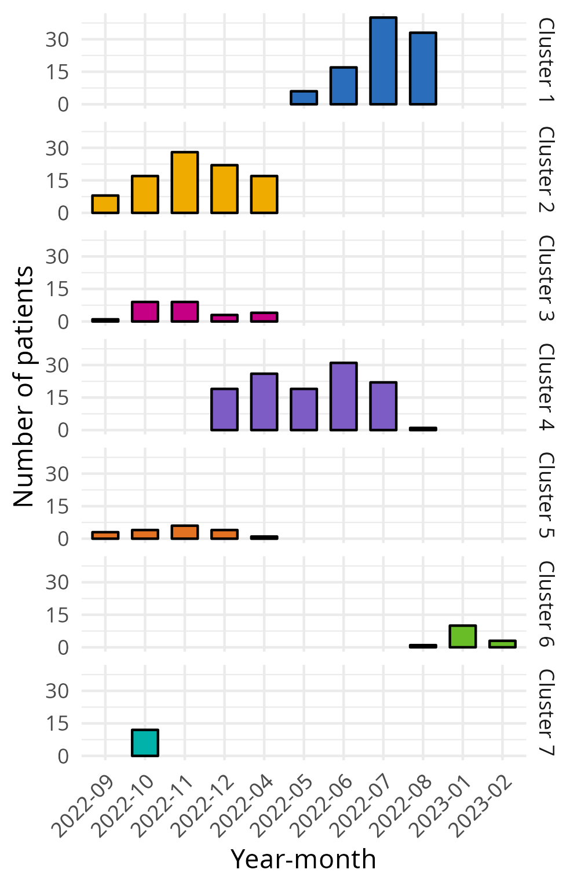

---
## compile with:
## Rscript -e "rmarkdown::render('manuscript.Rmd', output_format = 'all')"
## libreoffice --headless --convert-to pdf manuscript.docx
title: "Feasibility of a Cluster Randomised Trial on the Effect of Trauma Life Support Training: A Pilot Study in India"
author: Trauma life support training Effectiveness Research Network (TERN) collaborators
bibliography: bibliography.bib
csl: nature.csl
output:
    bookdown::word_document2:
      toc: false
      number_sections: false
      reference_docx: "reference.docx"
#    md_document: default
#    bookdown::pdf_document2:
#      toc:false
#      number_sections:false
---

<!-- Source main code to make global objects available in the text -->
```{r source, echo = FALSE, include = FALSE}
source("main.R")
attach(results)
```

## Trial registration
This pilot study was registered with ClinicalTrials.gov (reg. no NCT05417243). 

## Corresponding author

##### Martin Gerdin Wärnberg, MD, PhD (MGW) `r insert_orcid_link("0000-0001-6069-4794")`

Department of Global Public Health  
Karolinska Institutet  
171 77 Stockholm  
Sweden  

martin.gerdin@ki.se  
+46 708 53 95 98 (mobile)

## Authors (in alphabetical order by last name)

##### Debojit Basak, MParm (DB) `r insert_orcid_link("0000-0002-8378-9689")` <!-- Accepted, debojit88@gmail.com -->
Project Research Scientist, Institute of Post Graduate Medical Education and Research, Kolkata, India.

##### Johanna Berg, MD (JB) `r insert_orcid_link("0000-0001-7553-7337")` <!-- Accepted, johanna.berg@ki.se -->
Department of Global Public Health, Karolinska Institutet, Stockholm, Sweden.  

Emergency Medicine, Department of Internal and Emergency Medicine, Skåne University Hospital, Malmö, Sweden.

##### Shamita Chatterjee, MBBS, MS (SC) `r insert_orcid_link("0000-0002-9460-108X")` <!-- Accepted, dr_shamita@yahoo.com -->
Department of Surgery, Institute of Post Graduate Medical Education and Research, Kolkata, India.

##### Li Felländer-Tsai, MD, PhD (LFT) `r insert_orcid_link("0000-0003-0693-6080")` <!-- Accepted -->
Division of Orthopaedics and Biotechnology, Department of Clinical Science Intervention and Technology (CLINTEC), Karolinska Institutet, Stockholm, Sweden.  

Department of Reconstructive Orthopedics, Karolinska University Hospital, Stockholm, Sweden.

##### Geeta Ghag (GG), MBBS, MS `r insert_orcid_link("0000-0001-5561-362X")` <!-- Accepted, geetaghag@hotmail.com -->
Department of Surgery, HBT Medical College And Dr. R N Cooper Municipal General Hospital, Mumbai, India.

##### Catherine Juillard, MD, MPH (CJ) `r insert_orcid_link("0000-0003-0847-8933")` <!-- Accepted, cjuillard@mednet.ucla.edu -->
Division of General Surgery, Department of Surgery, David Geffen School of Medicine at UCLA, Los Angeles, California, United States of America.

##### Monty Khajanchi, MBBS, MS (MK) `r insert_orcid_link("0000-0002-0898-6391")` <!-- Accepted, monta32@gmail.com -->
Seth G. S. Medical College and K.E.M. Hospital, Mumbai, India.

##### Tamal Khan, MSc (TK) <!-- Accepted, tamal.khan440@gmail.com -->
Senior Research fellow, All India Institute of Medical Sciences, New Delhi, India.

##### Vipul Nandu, MBBS, MS (VN) `r insert_orcid_link("0000-0002-3366-5610")`  <!-- Accepted, dr.vipulnandu@gmail.com -->
Department of Surgery, HBT Medical College And Dr. R N Cooper Municipal General Hospital, Mumbai, India.

##### Nobhojit Roy, MBBS, MS, PhD (NR) `r insert_orcid_link("0000-0003-2022-7416")` <!-- Accepted, nroy@georgeinstitute.org.in -->
Program for Global Surgery and Trauma, The George Institute of Global Health, New Delhi, India.

Department of Global Public Health, Karolinska Institutet, Stockholm, Sweden.

##### Rajdeep Singh, MBBS, MS (RS) `r insert_orcid_link("0000-0001-6593-2624")` <!-- Accepted, rajdeep.mamc@gmail.com -->
Department of Surgery, Maulana Azad Medical College, New Delhi, India.

##### Kapil Dev Soni, MBBS, MD (KDS) `r insert_orcid_link("0000-0003-1214-4119")` <!-- Accepted, kdsoni111@gmail.com -->
Critical and Intensive Care, JPN Apex Trauma Center, All India Institute of Medical Sciences, New Delhi, India.

##### Lovisa Strömmer, MD, PhD (LS) `r insert_orcid_link("0000-0001-5424-7111")` <!-- Accepted, lisa.strommer@ki.se -->
Division of Surgery and Oncology, Department of Clinical Science, Intervention and Technology (CLINTEC), and Department of Global Public Health, Karolinska Institutet, Stockholm, Sweden.

## Nonauthor contributors

<!--
##### Prashant Bhandarkar (PB)
WHO collaboration Centre for Research in Surgical Care Delivery in LMIC, Mumbai, India.
-->

##### Anirban Chatterjee (AC) <!-- Accepted -->
Department of Orthopaedic Sciences, Medica Superspecialty Hospital, Kolkata, India.

<!--
##### Chintamani (C)
Department of Surgery, Vardhman Mahavir Medical College and Safdarjung Hospital, New Delhi, India.
-->

<!--
##### Anita Gadgil (AG)
WHO collaboration Centre for Research in Surgical Care Delivery in LMIC, Mumbai, India.
-->

##### Marie Hasselberg (MH) <!-- Accepted -->
Department of Global Public Health, Karolinska Institutet, Stockholm, Sweden.

<!--
##### Deepa Kizhakke Veetil (DKV)
Department of Surgery, Manipal Hospital, Dwarka, New Delhi.
-->

<!--
##### Vineet Kumar (VK)
Department of Surgery, Lokmanya Tilak Municipal Medical College and General Hospital, Mumbai, India.
-->

##### Debabrata Kundu (DK) <!-- Accepted -->
Department of Surgery, Medical College Kolkata, Kolkata, India. 

##### Anurag Mishra (AM) <!-- Accepted -->
Department of Surgery, Maulana Azad Medical College, New Delhi, India.

<!--
##### Priti Patil (PP)
WHO collaboration Centre for Research in Surgical Care Delivery in LMIC, Mumbai, India.
-->

##### Arun Prasad (AP) <!-- Accepted -->

Department of Surgery, Indraprastha Apollo Hospitals, New Delhi

<!--
##### Amit Roy (AR)
Department of Surgery, Sir Nil Ratan Sircar Medical College & Hospital, Kolkata, India.
-->

<!--
##### Siddarth David (SD)
Department of Global Public Health, Karolinska Institutet, Stockholm, Sweden.  

Doctors For You, Mumbai, India.
-->

##### Harris Solomon (HS) <!-- Accepted -->
Department of Cultural Anthropology and the Duke Global Health Institute, Duke University, Durham, USA.

##### Megha Tandon (MT) <!-- Accepted -->
Department of Surgery, Vardhman Mahavir Medical College and Safdarjung Hospital, New Delhi, India.

## Keywords
Trauma management, Accident and emergency medicine, Education and training.

## Word Count
2836

## Role of study sponsor and funders
The funding sources had no role in the design of this study nor during its execution, analyses, interpretation of the data, or decision to submit the results.

<!-- \newpage -->

# Abstract

**Objective** The aim was to assess the feasibility of conducting a cluster randomised controlled trial comparing the effects of Advanced Trauma Life Support (ATLS) and Primary Trauma Care (PTC) with standard care on patient outcomes.

**Design** This was a pilot pragmatic three-armed parallel, cluster randomised, controlled trial conducted between `r start.date` and `r end.date`. Patient were followed up for 30 days.

**Setting** The study setting was tertiary care hospitals across metropolitan areas in India.

**Participants** Adult trauma patients and residents managing these patients were included.

**Interventions** ATLS or PTC training was provided for residents in the intervention arms.

**Main Outcomes and Measures** The outcomes were the consent rate, lessons to follow up rate, missing data rates, differences in the distribution between observed data and data extracted from medical records, and the resident pass rate.

**Results** Two hospitals were randomised to the ATLS arm, two to the PTC arm, and three to the standard care arm. We included `r n.patients` patients and `r n.residents` residents. The percentage of patients who consented to follow up was `r p.consent`% and the percentage of residents who consented to receive training was `r recruitment.rate.residents`%. The loss to follow up rate was `r rate.lost.to.follow.up`%. The pass rate was `r pass.rate`%. Overall, the amount of missing data for key variables was low. The data collected through observations were similar to data extracted from medical records, but there were more missing extracted data. 

**Conclusions** Conducting a full-scale cluster randomised controlled trial comparing the effects of ATLS, PTC, and standard care on patient outcomes appears feasible, especially if such a trial would use data and outcomes available in medical records. 

**Trial Registration** ClinicalTrials.gov (reg. no NCT05417243)

# Strengths and limitations of this study

- Prospective data collection with direct observations made by dedicated research officers.
- A lack of a priori defined success criteria and thresholds for feasibility outcomes.
- The use of sealed envelopes potentially compromised allocation concealment.
- Heterogeneity of the participating centers may affect the study estimates and introduce bias.

\newpage

<!--
# Article Summary

Strengths and limitations of this study:

- Cluster randomised controlled trial comparing the effect of ATLS, PTC and standard care on patient and provider outcomes.
- Prospective data collection with direct observations by dedicated research officers.
- Participating centers' heterogeneity may affect the study estimates and bias the results.
-->

# Introduction

Trauma, defined as a clinical entity composed of physical injury and the associated response of the body, causes 4.3 million deaths every year [@gbd_2021_collaborators_injuries_2024]. Several trauma life support training programmes have been developed to improve the early management of patients in hospitals by providing a structured framework for assessment and treatment [@Mohammad2013; @Jayaraman2014; @Kadhum2020; @Jin2021; @putra_impact_2023; @mciver_effect_2024].

Advanced Trauma Life Support (ATLS) and Primary Trauma Care (PTC) are the most established trauma life support training programmes [@acsAtls2018; @ptcfPtc2018]. Both programmes improve provider knowledge and skills [@Mohammad2013; @Kadhum2020], and while most observational studies associate them with reduced mortality [@vestrup_impact_1988; @ali_trauma_1993; @van_olden_clinical_2004; @Wang2010; @noordin_evolution_2011; @hashmi_hospital-based_2013; @Petroze2014; @magnone_impact_2015; @bellanova_mountain_2016; @kamau_impact_2024; @kumar_evaluating_2025], some report associations with increased mortality [@drimousis_advanced_2011; @CioèPeña2016].

There are no controlled trials of the effect of ATLS or PTC on patient outcomes, and no trials evaluating any trauma life support training programme in a general trauma population [@Mohammad2013; @Jayaraman2014; @Kadhum2020; @Jin2021; @putra_impact_2023; @mciver_effect_2024]. However, a recent cluster randomised trial found that the rural trauma team development course reduced mortality in patients with motorcycle injuries [@lule_impact_2025]. 

Systematic reviews call for controlled trials of ATLS and PTC [@Mohammad2013; @Jayaraman2014; @Kadhum2020], but large scale cluster randomised trials can be complex. We therefore conducted a pilot study with the aim to assess the feasibility of a cluster randomised controlled trial comparing the effects of ATLS and PTC with standard care on outcomes in adult trauma patients. 

<!-- add citation to scoping review of TQIP [@mciver_effect_2024]-->

# Methods

## Protocol Deviations

Protocol deviations are mentioned where relevant in this manuscript, but a list of all deviations is also included as Supplementary Material S1 for completeness.

## Trial Design

We piloted a three-armed cluster randomised controlled trial [@GerdinWärnberg2022]. The trial included a standard care arm and two intervention arms, ATLS and PTC training. We planned to collect data for four months in all three arms, first during a one month observation phase, followed by a three-month intervention phase (or continued observation in the standard care arm). The actual data collection period varied across clusters depending on the timing of the training, to ensure a minimum of three months of data collection in the intervention clusters post-training. We included a one month observation phase to evaluate the feasibility of comparing patient outcomes both as absolute differences between the intervention phases, and as differences in changes from baseline. In the published protocol, we also aimed to estimate probable effect sizes and other parameters needed for sample size calculations for a full-scale trial [@GerdinWärnberg2022]. However, we revised this aim in light of current guidance on the conduct and reporting of pilot trials [@teresi_guidelines_2022].

## Study Setting

We conducted this pilot study in seven tertiary hospitals across metropolitan areas in India, where neither ATLS, PTC, nor any other established trauma life support training program is routinely taught. Details about each cluster are provided in Supplementary Table S1. We initially intented to include six hospitals as clusters, but added a seventh hospital when management expressed interest, as we had the budget to accommodate the request. These seven hospitals represented a convenience sample that fulfilled the inclusion criteria, and had existing connections to the research team.

<!--
The trauma system is still developing, with
limited prehospital care, and the in hospital trauma mortality as well
as the proportion of preventable deaths remain high. Lack of standard
trauma training for healthcare providers, limited hospital resources,
inadequate processes of care, overcrowding emergency departments - are
some of the factors that contribute to the high mortality and
morbidity. During recent years efforts have been made to improve
hospital trauma care, through capacity building for trained trauma
care providers, augmenting facilities, and developing care protocols
within the hospitals. 
-->

## Eligibility Criteria for Cluster and Participants

### Clusters

We defined a cluster as a tertiary care hospital in metropolitan areas in India that admit more than 400 adult patients with trauma annually, and has operation theatres, X-ray, CT, and ultrasound facilities, and blood bank available around the clock. In each cluster, we trained one or more units of physicians providing trauma care in the emergency department. To be eligible, units could have no more than 25% of their physicians with previous training in either ATLS, PTC, or similar training programmes. Residents who had received training in the last five years were considered trained. The 25% threshold was determined through consensus within the research team, to balance feasibility and the risk of contamination. The principal investigator at each hospital selected the units for training. We randomised at the hospital level to avoid contamination between the intervention and standard care arms. 

### Residents

We trained resident doctors undertaking speciality training in surgery or emergency medicine who managed trauma patients in the emergency department, and were expected to remain in the participating hospitals for at least one year after training. Consent was obtained from the residents in each intervention arm before ATLS or PTC training. In the published protocol, we stated that only surgical residents would be trained. However, in some of the participating hospitals, emergency medicine residents led the initial resuscitation and management of trauma patients, and we therefore included them in the training.

### Patients

We included persons aged 15 years or older who presented to the emergency department at participating hospitals with a history of trauma when a designated unit was on duty. A history of trauma was defined as having any of the external causes of morbidity and mortality listed in block V01-Y36, chapter 20 of the International Classification of Disease version 10 (ICD-10) codebook as the reason for presentation.

## Standard Care

Standard care varies across hospitals in India, but most surgical and emergency medicine departments in India organise their physicians into units. These units include both faculty members and residents, who are assigned a specific day of the week to work in the emergency department. Trauma patients are initially assessed by residents in these units, who also resuscitate patients, perform interventions and refer patients for imaging or other investigations. Compared with settings that adopt a trauma team approach, nurses and other healthcare professionals are involved to a limited extent during initial management. We did not collect data on how standard care varied between the participating hospitals.

## Intervention

In each intervention arm, residents from one or two units were trained in either ATLS or PTC at the beginning of the three month intervention phase. For the purpose of this pilot study, our target was to train at least 75% of residents in each unit. Faculty members were not trained, because they are typically not directly involved in the initial management of trauma patients. ATLS training was conducted at an ATLS certified training centre in Mumbai and PTC training was conducted in New Delhi. Both trainings were conducted according to their respective standard curriculum [@acsAtls2018; @ptcfPtc2018], and we did not modify or adapt the delivery or content of these programmes during this pilot study. 

The provider courses of both programmes take place across two days, and focus on the assessment, resuscitation and stabilisation of trauma patients, with adaptions for different patient populations. Teaching is based on case discussions and skill stations. There are several important differences between the two programmes. The ATLS course focuses more on inter-hospital patient transfers and includes a greater emphasis on the trauma team [@acsAtls2018]. In contrast, the PTC course focuses on trauma care in the low resource setting [@ptcfPtc2018]. The ATLS programme is run by the American College of Surgeons and requires a participant fee, whereas the PTC programme is run by the UK-based PTC Foundation and is provided free of charge.

## Feasibility Outcomes

Our feasibility outcomes were as follows: 

- Consent rates of patients and residents. This was defined as the percentage of patients or residents who consented to be included, out of the total number of eligible patients or residents. 
- Loss to follow-up rate. This applied only to patients and was defined as the percentage of patients among all included patients who did not complete the 30 day follow up.
- Missing data rate. This applied to each outcome and variable and was defined as the percentage of missing values.
- Differences in distributions between directly observed data and data extracted from medical records. Distribution refers to summary statistics and directly observed data refers to data collected by project officers while observing the delivery of care. This outcome applied to all variables that could be reasonably expected to be present in the medical records. To reduce workload, these data were extracted from a convenience sample of patients only.
- Pass rate. This applied only to residents in the intervention arms and was defined as the percentage of residents who passed the training programme, among all residents who received training.

We did not prespecify criteria to determine whether to proceed with a full-scale trial.

<!--The primary outcome and most secondary outcome were assessed and compared both as final values and as change from baseline. All outcomes that pertain to the individual participant level are detailed in Supplemental Material 1. We decided to include a large number of outcomes, including some more exploratory, so that we could test their feasibility and relevance. -->

## Sample Size

We aimed to include at least two clusters per arm to avoid basing conclusions on single centres. We also aimed to train at least two units per intervention cluster to evaluate the logistics of sending residents for training. We did not conduct a formal power calculation for this pilot, as the primary purpose of the study was to assess the feasibility of the trial logistics and research methods. We anticipated variation in the number of patients included per cluster depending on hospital patient volume.

## Participant Timeline and Inclusion

### Patients

Incoming patients were screened for eligibility and consented, if they were conscious and able to provide consent. For unconscious patients, consent was provided by a patient representative. These patients reaffirmed this proxy consent, upon regaining consciousness. Patients who did not regain consciousness remained included based on their representative's consent. We followed up patients at 24 hours and at 30 days after arrival at the emergency department. The follow-up period for each patient was therefore one month.

### Residents

Participating units were screened for eligibility once the hospitals confirmed participation. All residents in these units were approached for consent to training if their hospital was randomised to one of the intervention arms. The protocol stated that residents would be approached for consent before randomisation, but this proved not to be feasible. Instead, we asked residents for consent after the hospitals were randomised but before training. Training took place approximately one month after study initiation in that hospital. We initially planned to use simple random sampling to select the units to be trained, but for pragmatic reasons the decision on which units to train was left to the site principal investigator. The number of residents trained in each intervention cluster varied based on the unit size.

## Allocation and Blinding

We used simple randomisation implemented using sealed envelopes to allocate sites to the trial arms. It was not possible to blind investigators, residents or patients to the intervention. Data analysts were not blinded.

## Data Collection

The planned data collection period was four months. However, the actual period varied across clusters depending on the timing of the training, to ensure a minimum of three months of data collection after the training in the intervention clusters. Research officers collected data on all patients who presented on the days and shifts when participating residents were assigned to trauma care. The research officers observed care, interviewed residents and patients, and extracted data from hospital records. Admitted patients were followed up for complications and other in-hospital outcome measures. Patients who were not admitted or who were discharged before the end of the study were followed up by telephone for mortality and quality-of-life. 

## Variables

Research officers collected data on demographics, vital signs, management details including imaging and surgery, and details of any injury sustained. All injuries were coded according to the International Classification of Diseases version 10 (ICD-10). Based on these codes, we calculated the Injury Severity Score (ISS) using the R package `icdpicr` [@icdpicr_2022]. The ISS is a widely used measure of injury severity and ranges from 0 to 75, with a cut-off score of 16 often used to define major trauma and 75 representing unsurvivable trauma. We also collected data on potential outcomes for the full-scale trial, including 30-day and in-hospital mortality, complications and health related quality of life (assessed using the EQ-5D-3L). We did not calculate an EQ-5D-3L index score, because no Indian value set is currently available [@jyani_development_2022]. We also attempted to collect data on cause of death. A list of variables is available in Supplementary Table S2.<!--Supplemental Material 2 contains a full variable list, with definitions.-->

## Patient and Public Involvement

We conducted community consultations with patients, their caregivers, patient groups, and resident doctors to inform the selection of outcome measures and implementation of the full-scale trial. Results of these consultations are published separately [@david_patient-reported_2024]. We initially planned to distribute periodic surveys to residents and follow them up 30 days after training, but this was later changed to end-of-study interviews to allow for richer data (not published).

<!--
## Data management
We used the online data collection tool KoboToolbox [@KoboToolbox], accessible only over a virtual private network (VPN), for each participating hospital to upload pseudonymised data to secure servers. Data validation techniques such as restricted values or values within a specific range were used to avoid ambiguous data entries and ensure the validity of the data. Ambiguous responses and errors were resolved after discussion with the core team during weekly meetings. An instruction manual or codebook for data variables was prepared to ensure consistency in data entry. This manual was referred to during the project data collection and variable descriptions were visible for each variable in the online data collection tool. Pseudonymised data were stored at the centralised server. The data were only accessible by the project's principal investigator or by delegation by the project principal investigator.
-->

## Data Monitoring

Weekly online meetings were held to monitor study progress and data collection. One interim analysis was conducted approximately halfway through the study, and it was decided to complete the study, as residents and patients were consenting to be included in the study and key variables including mortality, could be collected. A formal data monitoring committee was not used.

## Statistical Methods

All analyses were conducted using `r version$version.string` statistical software [@R_2024]. Feasibility outcomes and other data were analysed using descriptive statistics and no formal hypothesis testing was performed. Initially, we planned to analyse feasibility outcomes at both the overall and individual cluster levels, but the sample sizes in individual clusters were too small to generate meaningful results. Quantitative variables are summarised as medians and interquartile ranges. Qualitative variables are presented as absolute numbers and percentages. Additional analyses performed according to the original protocol are available as additional online material [@warnberg_additional_2025].

## Ethics and Dissemination

We were granted research ethics approval from the institutional ethics committees at each participating hospital. For each hospital, the approvals were HBTMC/266/SURGERY for Dr R N  Cooper Municipal General Hospital in Mumbai, IEC(II)/OUT/134/2022 for Seth GS Medical College and KEM Hospital in Mumbai, ICC/214/22/20/05/2022 for Lokmanya Tilak Municipal Medical College and General Hospital, CREC/2022/FEB/1(ii) for MEDICA Superspeciality Hospital in Kolkata, MC/KOL/IEC/NON-SPON/1217/11/21 for Medical College, Kolkata, NRSMC/IEC/93/2021 for Nilratan Sircar Medical College & Hospital in Kolkata, and finally IEC-03/2022-2332 for the Postgraduate Institute of Medical Education and Research, Chandigarh.

# Results

We included `r n.patients` trauma patients from `r number_to_text(n.centres)` clusters between `r start.date` and `r end.date`. The  data collection period and the number of patients included per month per cluster are shown in Figure \@ref(fig:patients-per-month-figure). Owing to an error in the data uploading process, data were available only for one and three months in two clusters respectively. The standard care arm included `r n.control` patients, the ATLS arm included `r n.atls` patients, and the PTC arm included `r n.ptc` patients. A total of  `r number_to_text(n.residents)` residents were trained, `r number_to_text(n.atls.residents)` in ATLS and  `r number_to_text(n.ptc.residents)` in PTC. 

```{r patients-per-month-figure, echo = FALSE, results = "asis", fig.cap = "Number of patients included per cluster per month. Owing to an error in the data uploading process, data were available for only one and three months in two clusters respectively."}

```

The study flow diagram is shown in Figure \@ref(fig:flow-diagram), and patient sample characteristics across trial arms are shown in Table \@ref(tab:sample-characteristics). Extended patient sample characteristics are shown in Supplementary Table S2. Overall, `r females` patients were females, the median (interquartile range, IQR) age was `r median.age` years, and the median ISS (IQR) was `r median.iss`. These prognostic factors differed between the trial arms. A total of `r m30d` patients died within 30 days of arrival at the emergency department, and `r inhosp` patients died in the hospital. 

After training, a total of `r m30d.standard.care` patients in the standard care arm died within 30 days, compared with `r m30d.atls` patient in the ATLS arm and `r m30d.ptc` patients in the PTC arm. The corresponding rates for in-hospital mortality were `r inhosp.standard.care`, `r inhosp.atls`, and `r inhosp.ptc` for the standard care, ATLS and PTC arms, respectively. 

```{r flow-diagram, echo = FALSE, fig.cap="Study flow diagram. Abbreviations: ATLS, Advanced Trauma Life Support; PTC, Primary Trauma Care.", out.width="30%", out.height="30%"}

```

```{r sample-characteristics, echo = FALSE, results = "asis", tab.cap = "Patient sample characteristics"}
sample.characteristics.table |>
  modify_caption("Patient sample characteristics")
```

## Outcomes

The percentage of patients who consented to follow-up was `r p.consent`% and the percentage lost to follow-up was `r rate.lost.to.follow.up`%. The missing data rate ranged from `r min.missing.data`% to `r max.missing.data`%, with details for selected variables shown in Table \@ref(tab:sample-characteristics) and in Supplementary Table S2. The variables with the largest amount of missing data were  the cost of treatment, complications and cause of death, also reported in Supplementary Table S2. 

Differences in distributions between directly observed data and data extracted from medical records for selected variables collected through observation or interviews are shown in Table \@ref(tab:observed-vs-extracted). Overall, the data were similarly distributed, but there were considerably more missing values in the data extracted from medical records than in the directly observed data. 

The percentage of residents who consented to training was `r recruitment.rate.residents`% and the pass rate was also `r pass.rate`%. 

```{r observed-vs-extracted, echo = FALSE, tab.cap = "Differences in distributions between directly observed data and data extracted from medical records, for selected variables collected through observation or interview in a convenience sample of patients."}
observed.vs.extracted.comparison.table
```

# Discussion

We demonstrated that it is feasible to conduct and collect data for a cluster randomised controlled trial comparing ATLS with PTC and standard care. The missing data rate was low for key variables. However, some variables had very high missing data rates and may not be feasible to include in a full-scale trial, or may require different data collection methods. The missing data rate was substantially higher when data were extracted from medical records rather than directly observed, although the distributions were similar. Thus suggests that data collected from medical records are reliable even if they are less complete. To increase the completeness of data extracted from the medical records, a full-scale trial should limit the number of variables extracted from medical records and emphasise the importance of having these variables recorded to the participating hospitals.

<!-- Should we include dependency at discharge, for example using the
Modified Oxford Handicap Scale used in @Roberts2013?-->

All-cause 30-day mortality data were missing for `r rate.lost.to.follow.up`% of patients. This rate may be high, especially compared to, for example, the CRASH-2 and REACT-2 trials, which reported missing primary outcomes for fewer than 0.01% of patients [@Roberts2013; @Sierink2016]. Like many other trauma trials, both CRASH-2 and REACT-2 used in-hospital mortality as their primary outcome measure, whereas we attempted to follow patients after discharge. Our missing data rate for in-hospital mortality was only `r p.missing.in.hospital.mortality`%, which is comparable to those in previous trials. Following patients after discharge is notoriously challenging in this setting, and the full-scale trial may need to focus on in-hospital mortality as the primary outcome. 

<!-- Consider discussing non-inferiority vs superiority. -->

During this pilot study we deviated from the protocol in several ways. The most significant deviation was a revision of the study aim, as we initially intended to estimate potential effect sizes and other parameters to help sample size calculations for a full-scale trial, in addition to assessing the feasibility outcomes. However, current guidance advises against using pilot studies to estimate effect sizes, as the usefulness of these estimates is questionable [@eldridge_how_2015; @teresi_guidelines_2022]. We therefore chose to report patient outcomes descriptively. Another significant deviation was the training of emergency medicine residents. We originally planned to train only surgical residents, but trauma management routines varied between participating hospitals, and we adapted to local routines. A full-scale study will need to accommodate this variation as part of the protocol. 

There are several significant limitations of this pilot study and, therefore, additional lessons to be learned and factored into the design of a full-scale trial. First, the patient volumes at some of the participating hospitals were lower than expected. A careful assessment of patient volumes as part of the screening process should be included for a full-scale trial. Second, data on complications and causes of death were almost universally missing. Collecting data on these variables will require alternative methods, as these were not explicitly described in the medical records and autopsy reports were not readily available. Third, we did not collect detailed data on the standard care at each hospital. These data should be collected as part of the screening process for a full-scale trial. Fourth, we used sealed envelopes for randomisation, which increases the risk of bias and errors. A full-scale trial should use a computer-generated randomisation system. Fifth, we did not blind the data analysts, but recommend doing so in a full-scale trial. Sixth, we assessed a large number of potential outcomes, and a full-scale trial should focus on the most relevant outcomes. Seventh, the follow-up period was only one month, and changes in some of the outcomes may take longer than that to manifest. The effect on the outcomes is also likely to depend on the adherence to the training, which is not assessed in this pilot study. Finally, owing to a data uploading error, limited data were available from two clusters. At the time of data collection, network and other technical issues were present in some of the clusters, which could explain this error. Regardless, this is a major concern that must be mitigated in a full-scale trial by using a more robust data collection system with local offline backups and careful centralised monitoring. 

<!-- Consider discussing waiver of informed consent for initial 
data collection -->

Previous studies on the effects of ATLS or PTC training on patient outcomes have been observational or quasi-experimental without a control group, with heterogeneous results [@vestrup_impact_1988, @Ariyanayagam1992; @ali_trauma_1993; @van_olden_clinical_2004; @VanHeng2008; @Wang2010; @drimousis_advanced_2011; @noordin_evolution_2011; @hashmi_hospital-based_2013; @Petroze2014; @magnone_impact_2015; @bellanova_mountain_2016; @CioèPeña2016; @kamau_impact_2024; @kumar_evaluating_2025]. Most suggest that these programmes are associated with improved outcomes, although not all report significant effects [@vestrup_impact_1988; @ali_trauma_1993; @van_olden_clinical_2004; @Wang2010; @noordin_evolution_2011; @hashmi_hospital-based_2013; @Petroze2014; @magnone_impact_2015; @bellanova_mountain_2016; @kamau_impact_2024; @kumar_evaluating_2025]. In contrast, some studies have shown potential associations with increased mortality [@drimousis_advanced_2011; @CioèPeña2016]. We observed fewer deaths in the intervention arms than in the standard care arm. This difference may have resulted from the randomisation process with a small number of heterogeneous clusters, highlighting the importance of taking varying cluster sizes into account when designing a full-scale trial.

A full-scale trial remains ethically justifiable after this pilot study, considering that it was never powered to detect meaningful differences in clinical outcomes. In addition, educating physicians in trauma life support through programmes such as ATLS and PTC is considered standard care in many settings, but this approach has been criticised for being costly and for propagating outdated practices [@wiles_atls_2015]. Several systematic reviews have called for trials in settings where these programmes are not routinely implemented [@Mohammad2013; @Jayaraman2014; @Kadhum2020]. In recognition of their widespread use and high face validity, a stepped-wedge design in which all clusters receive the intervention but at randomised time points may be the best trial design. With regards to generalisability, the study was conducted in India, and the results are likely to be generalisable to other settings with similar trauma care systems. The findings may be less generalisable to settings where senior faculty are more directly involved in the initial management of trauma patients, as these were not trained in this pilot study. 

Our study represents the first published attempt to pilot a controlled trial evaluating the effect of ATLS and PTC on patient outcomes. We conclude that a full-scale cluster randomised trial is feasible after incorporating the lessons of this pilot study. 
 
# Contributorship statement

MGW conceived the study, performed the analysis and drafted and revised the manuscript. AG, AM, CJ, DKV, HS, JB, KDS, LFT, LS, MH, MK, NR, PB, PP, RS, SD, and VK contributed to the design of the study. MGV, DKV, KDS, and MK drafted the first version of the protocol. AG, HS, and SD drafted the first version of the patient and public involvement activities. JB and PP drafted the first versions of the data management sections and wrote the data management plan. PB and PP drafted the first versions of the statistical analysis section. AG, AM, CJ, DKV, HS, JB, KDS, LFT, LS, MH, MGW, MK, NR, PB, PP, RS, SC, SD, and VK contributed to the refinement of the protocol. DB, JB, SC, LFT, GG, MK, TK, CJ, NR, RS, KDS, LS and VP interpreted the results and revised the manuscript. AR, AC, C, DK, GG, MK, MT, VK and VP are representatives of the participating hospitals. MGW is the guarantor.

# Competing Interests

LS, KDS, MK, and SC are ATLS instructors. All other authors have no completing interest to declare.

# Funding

Doctors for You through grants awarded to Karolinska Institutet by the Swedish Research Council (grant number 2020-03779) and the Laerdal Foundation (grant number 2021-0048).

# Data Sharing Statement

The code for the analysis is released publicly on GitHub (https://github.com/martingerdin/tern-pilot). The final anonymised dataset is available from the corresponding author upon request.

\pagebreak

# References

