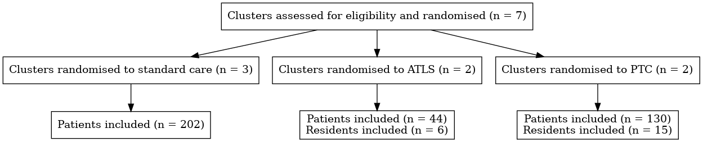

---
## compile with:
## Rscript -e "rmarkdown::render('manuscript.Rmd', output_format = 'all')"
title: A Pilot Multicenter Cluster Randomized Trial to Compare The Effect of Trauma Life Support Training Programs on Patient and Provider Outcomes  
author: Trauma life support training Effectiveness Research Network (TERN) collaborators
bibliography: bibliography.bib
csl: nature.csl
output:
    bookdown::pdf_document2:
      toc: false
      number_sections: false
    md_document: default
    bookdown::word_document2:
      toc: false
      number_sections: false
      reference_docx: "reference.docx"
---

## Trial registration
This pilot study was registered with ClinicalTrials.gov (reg. no NCT05417243). 

## Corresponding author
Martin Gerdin Wärnberg (MGW)  

Department of Global Public Health  
Karolinska Institutet  
171 77 Stockholm  
Sweden  

martin.gerdin@ki.se  
+46 708 53 95 98 (mobile)  

## Authors

##### Johanna Berg (JB)
Department of Global Public Health, Karolinska Institutet, Stockholm, Sweden.  

Emergency Medicine, Department of Internal and Emergency Medicine, Skåne University Hospital, Malmö, Sweden.

##### Shamita Chatterjee (SC)
Department of Surgery, Institute of Post Graduate Medical Education and Research, Kolkata, India.

##### Li Felländer-Tsai (LFT)
Division of Orthopaedics and Biotechnology, Department of Clinical Science Intervention and Technology (CLINTEC), Karolinska Institutet, Stockholm, Sweden.  

Department of Reconstructive Orthopedics, Karolinska University Hospital, Stockholm, Sweden.

##### Geeta Ghag (GG)
Department of Surgery, HBT Medical College And Dr. R N Cooper Municipal General Hospital, Mumbai, India.

##### Monty Khajanchi (MK)
WHO Collaboration Centre for Research in Surgical Care Delivery in LMIC, Mumbai, India.  

Seth G. S. Medical College and K.E.M. Hospital, Mumbai, India.

##### Catherine Juillard (CJ)
Division of General Surgery, Department of Surgery, David Geffen School of Medicine at UCLA, Los Angeles, California, United States of America.

##### Nobhojit Roy (NR)
WHO Collaborating Center for Research on Surgical Care Delivery in LMICs, BARC Hospital, HBNI University, Mumbai, India.  

Department of Global Public Health, Karolinska Institutet, Stockholm, Sweden.

##### Arun Prasad (AP)

Department of Surgery, Indraprastha Apollo Hospitals, New Delhi

##### Rajdeep Singh (RS)
Department of Surgery, Maulana Azad Medical College, New Delhi, India.

##### Kapil Dev Soni (KDS)
Critical and Intensive Care, JPN Apex Trauma Center, All India Institute of Medical Sciences, New Delhi, India.

##### Lovisa Strömmer (LS)
Division of Surgery, Department of Clinical Science, Intervention and Technology (CLINTEC), Karolinska Institutet, Stockholm, Sweden.  

Department of Surgery, Capio St Göran Hospital, Stockholm, Sweden.

##### Vipul Nandu
Department of Surgery, HBT Medical College And Dr. R N Cooper Municipal General Hospital, Mumbai, India.

##### Debojit Basak
Project Research Scientist, Institute of Post Graduate Medical Education and Research, Kolkata, India.

##### Tamal Khan 


## Non-author contributors

Trauma life support Effectiveness Research Network (TERN) collaborators: 

##### Prashant Bhandarkar (PB)
WHO collaboration Centre for Research in Surgical Care Delivery in LMIC, Mumbai, India.

##### Anirban Chatterjee (AC)
Department of Orthopaedic Sciences, Medica Superspecialty Hospital, Kolkata, India.

##### Chintamani (C)
Department of Surgery, Vardhman Mahavir Medical College and Safdarjung Hospital, New Delhi, India.

##### Anita Gadgil (AG)
WHO collaboration Centre for Research in Surgical Care Delivery in LMIC, Mumbai, India.

##### Marie Hasselberg (MH)
Department of Global Public Health, Karolinska Institutet, Stockholm, Sweden.

##### Deepa Kizhakke Veetil (DKV)
Department of Surgery, Manipal Hospital, Dwarka, New Delhi.

##### Vineet Kumar (VK)
Department of Surgery, Lokmanya Tilak Municipal Medical College and General Hospital, Mumbai, India.

##### Debabrata Kundu (DK)
Department of Surgery, Medical College Kolkata, Kolkata, India. 

##### Anurag Mishra (AM)
Department of Surgery, Maulana Azad Medical College, New Delhi, India.

##### Priti Patil (PP)
WHO collaboration Centre for Research in Surgical Care Delivery in LMIC, Mumbai, India.

##### Amit Roy (AR)
Department of Surgery, Sir Nil Ratan Sircar Medical College & Hospital, Kolkata, India.

##### Siddarth David (SD)
Department of Global Public Health, Karolinska Institutet, Stockholm, Sweden.  

Doctors For You, Mumbai, India.

##### Harris Solomon (HS)
Department of Cultural Anthropology and the Duke Global Health Institute, Duke University, Durham, USA.

##### Megha Tandon (MT)
Department of Surgery, Vardhman Mahavir Medical College and Safdarjung Hospital, New Delhi, India.

## Keywords
Trauma management, Accident and emergency medicine, Education and training.

<!--
## Word Count
4494
 -->

## Role of study sponsor and funders
The funding sources had no role in the design of this study nor during its execution, analyses, interpretation of the data, or decision to submit the results.

<!-- \newpage -->

<!-- Source main code to make global objects available in the text -->
```{r source, echo = FALSE, include = FALSE}
source("main.R")
attach(results)
```

# Abstract

**Introduction** Trauma life support training programmes aim to improve trauma outcomes but there is no evidence from controlled trials to show that they work. We conducted a pilot study to assess the feasibility of conducting a cluster randomised controlled trial comparing the effect of Advanced Trauma Life Support^®^ (ATLS^®^) and Primary Trauma Care (PTC) with standard care on patient outcomes. **Methods and analysis** We piloted a pragmatic three-armed parallel, cluster randomised, controlled trial in India, where neither of these programmes are routinely taught. We recruited tertiary hospitals and included trauma patients and residents managing these patients. Two hospitals were randomised to ATLS^®^, two to PTC, and three to standard care. The primary outcome was all cause mortality at 30 days from the time of arrival to the emergency department. We conducted community consultations in parallel with the pilot trial. **Ethics and dissemination** We obtained ethical approval from all participating centres. **Results** Between `r start.date` and `r end.date` we included `r n.patients` patients and `r n.residents` residents from `r n.centres` centres. The percentage of patients who consented to follow up was `r p.consent`% and the resident recruitment rate was `r recruitment.rate.residents`%. The lost to follow up rate was `r rate.lost.to.follow.up`%. `r m30d.standard.care` patients died within 30 days in the standard care arm, `r m30d.atls` patients in the ATLS^®^ arm, and `r m30d.ptc` patients in the PTC arm. **Conclusions** Conducting a full-scale cluster randomised controlled trial comparing the effects of ATLS^®^, PTC, and standard care on patient outcomes should be feasible after incorporating key lessons from this pilot. 

\newpage

<!--
# Article Summary

Strengths and limitations of this study:

- Cluster randomized controlled trial comparing the effect of ATLS^®^, PTC and standard care on patient and provider outcomes.
- Prospective data collection with direct observations by dedicated project officers.
- Participating centers' heterogeneity may affect the study estimates and bias the results.
-->
\newpage

# Introduction

Trauma, defined as the clinical entity composed of physical injury and the body's associated response, causes 4.3 millions deaths every year [@injuries2020]. Almost 10% of the global burden of disease is due to trauma and trauma is the top contributor to the burden of disease in children and adults aged 10 to 49 years [@Vos2020].

Trauma care is time sensitive and early management of life or limb threatening conditions is crucial. Several trauma life support training programs have been developed to improve the early management of patients as they arrive at hospital by providing a structured framework to assessment and treatment [@Mohammad2013; @Jayaraman2014; @Kadhum2020].

The proprietary Advanced Trauma Life Support^®^ (ATLS^®^) is the most established trauma life support training program and more than one million doctors in over 80 countries have been trained in the programme [@acsAtls2018]. Uptake in low- and middle income countries (LMIC) has been slow, potentially due to high costs [@Kadhum2020].

The free Primary Trauma Care (PTC) program is the most widely spread alternative programme. The goal of PTC is to improve trauma care in LMIC [@ptcfPtc2018]. Like ATLS^®^, doctors in over 80 countries have been trained in PTC, and the programme has been endorsed by the World Health Organization (WHO), among other international organizations including several professional societies [@ptcfPtc2018].

There are observational studies indicating that trauma life support training programmes may improve patient outcomes [@Jin2021], but there are no randomised trials  [@Mohammad2013; @Jayaraman2014; @Kadhum2020].  We performed a pilot study aiming to assess the feasibility of conducting a cluster randomised controlled trial comparing ATLS^®^ and PTC with standard care.

# Methods

## Trial Design
We piloted a three-armed cluster randomised controlled trial. There were two intervention arms, ATLS^®^ and PTC training, and one control arm, standard care. We collected data for four months in all three arms, first during a one month observation phase and then during a three month intervention phase (or continued observation in the control arm). This design allowed us to assess outcomes both as final values and as change from baseline. 

Our study is a pilot study because its objectives involves estimating quantities, such as the probable effect sizes, proportion of participants with the outcome (if binary), and the intracluster correlation coefficient, needed for the sample size calculations of a full-scale trial [@Hemming2017]. This pilot study also establish how many participants that can be enrolled, as well as likely drop out rates, and the feasibility of collecting primary and secondary outcomes.

## Study Setting
We conducted this pilot in seven Indian tertiary hospitals, where neither ATLS^®^, PTC, nor any other trauma life support training program is routinely taught. The seven hospitals were Seth G. S. Medical College and K.E.M. Hospital, Mumbai; Lokmanya Tilak Municipal Medical College and General Hospital, Mumbai; HBT Medical College And Dr. R N Cooper Municipal General Hospital, Mumbai; Medica Superspecialty Hospital, Kolkata; Medical College Kolkata, Kolkata; Sir Nil Ratan Sircar Medical College & Hospital, Kolkata; Postgraduate Institute of Medical Education & Research, Chandigarh.

<!--
The trauma system is still developing, with
limited prehospital care, and the in hospital trauma mortality as well
as the proportion of preventable deaths remain high. Lack of standard
trauma training for healthcare providers, limited hospital resources,
inadequate processes of care, overcrowding emergency departments - are
some of the factors that contribute to the high mortality and
morbidity. During recent years efforts have been made to improve
hospital trauma care, through capacity building for trained trauma
care providers, augmenting facilities, and developing care protocols
within the hospitals. 
-->

## Eligibility Criteria for Participants and Clusters
There were two groups of participants: patients and resident doctors.

### Patient Participants
Adults (15 years or older) who presented to the emergency department at participating hospitals with a history of trauma. History of trauma is here defined as having any of the external causes of morbidity and mortality listed in block V01-Y36, chapter XX of the International Classification of Disease version 10 (ICD-10) codebook as reason for presenting. We explored intervention effects across the following clinical subgroups: men, women, blunt multisystem trauma, penetrating trauma, shock, severe traumatic brain injury, and elderly, as defined by Hornor et al [@Hornor2018].

### Resident Doctor Participants
Resident doctors doing their speciality training in surgery or emergency medicine managing trauma patients in the emergency department and who were expected to remain in the participating hospitals for at least one year. To facilitate administration each surgical department is divided into units, which manage the out-patient and emergency departments, operating rooms etc on different days each week. One or two, out of typically six, units' residents were selected from each hospital. One unit consists of at least three faculty and three to twelve residents.

To be eligible, units had to have a maximum of 25% of the doctors trained in either ATLS^®^, PTC, or similar training programs before the start of the pilot. Those residents who had received training in the last five years were considered as trained. The figure of 25% was decided through consensus in the research team, to balance feasibility and contamination of results.

Consent was sought from the residents in each of the intervention groups before they underwent the ATLS^®^ or PTC training. We did not ask for consent from residents at the units in the control hospitals as their practice was not affected by this pilot and we did not collect any personal identifiable data on them. 

### Clusters
Indian tertiary care hospitals that admit more than 400 adult patients with trauma each year. We randomised on the cluster (hospital) level to avoid contamination between intervention and control arms. To be eligible for inclusion hospitals had to provide the following services round the clock: operation theatres, X-ray, CT, and ultrasound facilities, and blood bank. In addition the baseline admission rate had to be more than 35 adult patients with major trauma per month.

## Interventions
In each intervention arm one or two units', out of typically six, residents per hospital providing emergency care to trauma patients were trained in either ATLS^®^ or PTC. For the purpose of this pilot study, our target was to train a minimum of 75% of residents in each unit. If residents dropped out or changed units after training but before data collection was completed we planned to conduct additional training if needed to meet the 75% criterion, but this was not required. We did not train the units' faculty, as they are typically not directly involved in the initial management of trauma patients.

The ATLS^®^ training was conducted in an ATLS^®^ certified training centre in Mumbai, according to the standard ATLS^®^ curriculum [@acsAtls2018]. The PTC training was conducted in New Delhi, according to the standard PTC curriculum [@ptcfPtc2018]. These courses were conducted over a period of 2.5 to 3 days. The residents certified "pass" were considered as trained in respective courses.

The control group provided standard care with no intervention.

### Modifications
Both ATLS^®^ and PTC are standard training programs with fixed curricula [@acsAtls2018; @ptcfPtc2018]. We did not modify the delivery or content of these programs during this pilot.

### Adherence
The intervention was the training in either ATLS^®^ or PTC and resident participants were required to adhere to, i.e. participate in, the training, to be eligible for passing. We did not consider adherence to training contents during care delivery as adherence to the trial intervention.

### Standard Care
Standard care varies across hospitals in India, but trauma patients are initially managed by casualty medical officers, surgical residents, or emergency medicine residents. They are mainly first- or second-year residents who resuscitate patients, perform interventions and refer patients for imaging or other investigations. Compared with other settings where a trauma team approach is adopted, nurses and other healthcare professionals are only involved to a limited extent during the initial management. 

## Outcomes
Our pilot study included both participant and feasibility outcomes. Prior to deciding on these participant outcomes we searched the Core Outcome Measures in Effectiveness Trials (COMET) Initiative's database but were unable to identify appropriate core outcome sets for our populations of participants.

The primary participant outcome was all cause mortality within 30 days from the time of arrival to the emergency department. The primary outcome and most secondary outcome were assessed and compared both as final values and as change from baseline. All outcomes that pertain to the individual participant level are detailed in Supplemental Material 1. We decided to include a large number of outcomes, including some more exploratory, so that we could test their feasibility and relevance. 

We also assessed the following feasibility outcomes, which pertained both to overall study population as well as to the individual cluster level:

- Recruitment rate. For both patients and residents this was equal to the proportion of participants enrolled, out of the total number of eligible participants, over the course of the pilot study.
- Lost to follow up rate. This applied only to patients and was equal to the proportion of patients that did not complete 30 day follow up, out of all enrolled patients, over the course of the pilot study.
- Pass rate. This applied only to residents in the intervention arms and equal the proportion of residents that pass the training programme, out of the total number of trained residents, over the course of the pilot study.
- Missing data rate. This applied to each outcome and variable and was equal to the proportion of missing data, over the course of the pilot study.
- Differences in distributions of observed and extracted data. This applied to each outcome and variable and compared the distributions of data collected by observations versus extracted from hospital records. For quantitative variables this was be the difference in means, standard deviations, medians, interquartile ranges, and ranges. For qualitative variables this was the differences in absolute counts and percentages, across categories.

## Participant Timeline

### Patients
Patients were screened for eligibility as they arrived at the emergency department. Eligible patients were approached in the emergency department to consent to follow up, if they were conscious. If they were unconscious a patient representative was approached to consent to follow up. Once the patient was conscious we approached the patient to affirm the patient representative's consent. We followed up patients at discharge, at 24 hours after arrival at the emergency department, and at 30 days after arrival at the emergency department.

### Residents
Participating units were screened for eligibility once hospitals confirmed their participation. All residents in eligible units were approached to consent to training if their hospital was randomised to either of the intervention arms. Training was conducted approximately one month after the study started.

## Sample size
Given budget and time constraints, including the rotation of units in the emergency departments in Indian hospitals (which often happen on a six months basis) the feasible data collection period was four months. We assumed that each of the units saw 2-4 trauma patients per week and based on that estimated that if we selected a minimum of one unit per hospital then each hospital would enrol 8-16 patients per month and 32-64 patients during the four months of this pilot. With a 20% attrition rate we expected each hospital to enrol 26-51 patients, coming to a total sample size of between 156 and 306 patients for this pilot study.

## Recruitment
To ensure adequate recruitment we only approached hospitals that stated that the their volumes were high enough to allow us to reach the sample size goals detailed above. Patients were enrolled by a dedicated project officer as they arrived at the emergency department. The recruitment period was four months. Recruitment was monitored weekly through online conferences. No financial or non-financial incentives were provided to trial investigators or participants for enrolment.

## Allocation

### Sequence generation
We used simple randomisation to allocate sites to trial arms. We prepared seven sealed envelopes from which one representative from each pilot site selected one in a common meeting<!-- Meeting notes ../meetings/20220307/ -->. The content of the envelopes dictated what trial arm (ATLS^®^, PTC, or standard care) each hospital was allocated to. There were two hospitals in each of the intervention arms and three hospitals in the control arm.

### Concealment Mechanism
We did not conceal the sequence.

### Implementation
The random allocation sequence was generated by MGW. Clusters were enrolled by the project's core team. Patient participants were enrolled if they presented during the project officers shift. Resident participants were enrolled if they were in the units selected for training. The principal investigator at each hospital selected the units for training. For patient participants consent for follow up was sought after randomisation from patients or patient relatives as appropriate. For resident participants consent was also sought after randomisation. 

## Blinding
It was not possible to blind investigators or participants to
interventions. We did not blind the data analysts during this pilot, but we plan to blind the data analysts during the full-scale trial.

## Data Collection
Data collection started one month before the training was delivered, to establish a baseline. Each participating hospital had a dedicated project officer who collected the data. 

Because participating residents were assigned designated days for trauma care for a period of 6 months, data were collected during those particular days and shifts when these trained doctors were in the emergency department. The project officers collected data both by observing the care delivered and by interviewing the participants, and by extracting data from hospital records.

Data collection continued for three months after training. The
research officers collected data of all trauma patients who presented to the participating units during their duty hours. Those patients who were admitted were followed up for complications and other in-hospital outcome measures, for example length of stay. Patients who were not admitted were followed up telephonically for mortality outcomes and quality of life outcomes. The follow up period was be 30 days. The project officers made at most three attempts to reach a participant or participant representative telephonically, after which the data were recorded as missing.

The project officer administered the study information and informed consent (consent was sought only for data collection including follow up) to the patient, or the patient's representative as appropriate, once the patient was stabilised. They will continue to collect data once they have received the consent.

Details of data of those patients/relatives not willing to give consent were not included in the analysis. The number of patients who opt out from data collection was collected. 

## Variables
The project officers collected data on demographics, time of injury to arrival at the participating hospital, time to recording vital signs, vital signs, and times to and management details including imaging and surgery. Details of any injury sustained were collected and coded using ICD 10 and the Abbreviated Injury Scale (AIS). For ICD 10 coders underwent the WHO online ICD 10 training module and for AIS they were accredited. Based on AIS we calculated the Injury Severity Score (ISS) and the New ISS (NISS). Supplemental Material 2 contains a full variable list, with definitions.

## Patient and public involvement
In this study, we conducted community consultations to collect
inputs from patients, their caregivers, patient groups, and resident doctors to be used in the selection of outcome measures and implementation of the full-scale trial; following the Guidance for Reporting Involvement of Patients and the Public (GRIIPS 2) [@Staniszewska2017]. The results of these consultations will be reported in a separate publication.

## Data management
We used the online data collection tool KoboToolbox [@KoboToolbox], accessible only over a virtual private network (VPN), for each participating hospital to upload pseudonymised data to secure servers. Data validation techniques such as restricted values or values within a specific range were used to avoid ambiguous data entries and ensure the validity of the data. Ambiguous responses and errors were resolved after discussion with the core team during weekly meetings. An instruction manual or codebook for data variables was prepared to ensure consistency in data entry. This manual was referred to during the project data collection and variable descriptions were visible for each variable in the online data collection tool. Pseudonymised data were stored at the centralised server. The data were only accessible by the project's principal investigator or by delegation by the project principal investigator.

## Data monitoring
Weekly meetings with the core team and project officers took place. We conducted an interim analysis on October 12, 2022, and decided to complete the study as participants were consenting to be included in the study and key variables including mortality outcomes could be collected. No outcomes were dropped. We did not use a data monitoring committee in the pilot study due to its limited scope.

## Statistical Methods
We analysed all pilot data using descriptive statistics. Quantitative variables are summarised as mean +/- standard deviation, median, interquartile range and range. Qualitative variables are presented as absolute numbers and percentages. Feasibility outcomes are summarised both on the overall sample level as well as on the individual cluster level. We used an empty generalised linear mixed model <!-- see [@Sommet2017] --> to estimate the intracluster correlation coefficient.

We compared participant outcomes in three combinations of trial arms: ATLS^®^ versus PTC, ATLS^®^ versus standard care, and PTC versus standard care. In each combination we compared both differences in final values and differences in change from baseline. For the intervention arms the change from baseline was calculated as the difference between the one month period of data collection before the training was undertaken and the three month period after the training. For the control arm the data collection period was four months and the difference from baseline was calculated as the difference between the first one month and the following three months.

Within each combination of trial arms we had planned to conduct subgroup analyses of men, women, blunt multisystem trauma, penetrating trauma, shock, severe traumatic brain injury, and elderly. These subgroups were however too small to allow for meaningful analyses, and are therefore reported descriptively only. 

We calculated both absolute and relative differences for each
comparison, along with 75, 85, and 95% confidence intervals. We used an empirical bootstrap procedure with 1000 draws to estimate these confidence intervals. We did not perform any formal hypothesis tests during the analysis of this pilot's data [@Lee2014]. We also compared the data collected through observations and interviews with the data collected from hospital records, to assess the feasibility of collecting data from hospital records in the full-scale trial.

## Ethics and Dissemination
We were granted research ethics approval from each participating hospital. The approval numbers were IEC(II)/OUT/134/2022 for King Edward Memorial Seth G. S. Medical College and K.E.M. Hospital, Mumbai; IEC/214/22 for Lokmanya Tilak Municipal Medical College and General Hospital, Mumbai; HBTMC/266/SURGERY for HBT Medical College And Dr. R N Cooper Municipal General Hospital, Mumbai; CREC/2022/FEB/1(ii) for Medica Superspecialty Hospital, Kolkata; Medical College Kolkata, Kolkata; NRSmC/IEC/93/2021 for Sir Nil Ratan
Sircar Medical College & Hospital, Kolkata; and PGI/IEC/2022/000/003 for Postgraduate Institute of Medical Education & Research, Chandigarh.

The protocol was published in BMJ Open [@GerdinWärnberg2022] and was registered with ClinicalTrials.gov (reg. no NCT05417243). Amendments to the protocol after publication were determined by the core research group and updated on ClinicalTrials.gov.

The final anonymized dataset and code for analysis are released publicly. Authorship follows the International Committee of Medical Journal Editors (ICMJE) guidelines.

# Results

Between `r start.date` and `r end.date`, we enrolled `r n.patients` trauma patients from `r n.centres` participating centres. The ATLS^®^ arm enrolled `r n.atls` patients, the PTC arm `r n.ptc` patients, and the standard care arm `r n.control` patients. We trained a total of  `r n.residents` residents, `r n.atls.residents` in ATLS^®^, and  `r n.ptc.residents` in PTC. 

The study flow diagram is shown in Figure \@ref(fig:flow-diagram) and patient sample
characteristics across trial arms are shown in Table \@ref(tab:sample-characteristics). Overall, the number of females were `r females`, the median (IQR) age was `r median.age` years, and the median ISS (IQR) was `r median.iss`. A total of `r m30d` patients had the primary outcome of mortality at 30 days after arrival to the emergency department.

```{r flow-diagram, echo = FALSE, fig.cap="Study flow diagram. Abbreviations: ATLS, Advanced Trauma Life Support; PTC, Primary Trauma Care."}
create_flow_diagram()

```

```{r sample-characteristics, echo = FALSE}
```

```{r sample-characteristics, echo = FALSE, results = "asis"}
```

```{r sample-characteristics, echo = FALSE, results = "asis"}
sample.characteristics.table
```

## Patient Participant Outcomes

After training, a total of `r m30d.standard.care` patients in the standard care arm had the primary outcome, compared to `r m30d.atls` patients in the ATLS^®^ arm and `r m30d.ptc` patients in the PTC arm. The absolute change from baseline in the primary outcome (95% CI) in the standard care arm was `r abs.change.standard.care`% units, in the ATLS^®^ arm `r abs.change.atls`% units, and in the PTC arm `r abs.change.ptc`% units. The relative change from baseline in the primary outcome (95% CI) in the standard care arm was `r rel.change.standard.care`, in the ATLS^®^ arm `r rel.change.atls`, and in the PTC arm `r rel.change.ptc`.

The absolute risk difference between the standard care and ATLS^®^ arms (95% CI) was `r arr.standard.care.atls`% units, between the standard care and PTC arms (95% CI) `r arr.standard.care.ptc`% units, and between the ATLS^®^ and PTC arms (95% CI) `r arr.atls.ptc`% units. The relative risk in the standard care arm compared with the ATLS^®^ arm (95% CI) was `r rr.standard.care.atls`, in the standard care arm compared with the PTC arm (95% CI) `r rr.standard.care.ptc`, and in the ATLS^®^ arm compared with the PTC arm (95% CI) the relative risk was `r rr.atls.ptc`. The absolute and relative differences in changes from baseline comparing the three arms are shown in Supplementary materials, along with data on all secondary outcomes.  

## Resident Participant Outcomes
A total of `r n.residents` residents were trained during this
pilot study. Overall their median confidence in managing trauma patients was `r median.confidence` (IQR `r iqr.confidence`) on a 10 point Likert scale with 10 being most confident. In the pre training period, the median confidence in the stadard care arm was `r median.comfort.standard.care.pre` (IQR `r iqr.comfort.standard.care.pre`), compared to `r median.comfort.atls.pre` (IQR `r iqr.comfort.atls.pre`) in the ATLS and `r median.comfort.ptc.pre` (IQR `r iqr.comfort.ptc.pre`) in the PTC arm. In the post training period, the corresponding figures were `r median.comfort.standard.care.post` (IQR `r iqr.comfort.standard.care.post`) in the standard care arm, `r median.comfort.atls.post` (IQR `r iqr.comfort.atls.post`) in the ATLS and `r median.comfort.ptc.post` (IQR `r iqr.comfort.ptc.post`) in the PTC arm. 

## Feasibility Outcomes
<!--Out of X potentially eligible patients, X (X%) patients were enrolled
in the study-->. Out of `r n.eligible.residents` potentially eligible residents, `r n.residents` (`r recruitment.rate.residents`%) participated in the study. The lost to follow up rate was `r rate.lost.to.follow.up`, with `r n.lost.to.follow.up` out of `r n.patients` patients not completing 30 day follow up. Among residents the pass rate, after two attempts, was `r pass.rate`%. The missing data rate ranged from `r min.missing.data` to `r max.missing.data`, with details for selected variables shown in Table \ref@(tab:sample-characteristics). The differences in distributions between observed and extracted data, for selected variables that were collected through observation or interview, are shown in Table \ref@(tab:observed-vs-retrospective). Overall, there were considerably more missing values in extracted data compared to observed data.

```{r observed-vs-retrospective, echo = FALSE}
retrospective.comparison.table %>%
  modify_caption("Differences in distributions between observed and extracted data, for selected variables that were collected through observation or interview.")
```

# Discussion
We show that conducting a cluster randomized controlled trial
comparing ATLS^®^ with PTC and standard care is feasible in this setting. Missing data were low for key variables, including the primary outcome and many secondary outcomes. Some variables had very high missing data rates and may not be feasible to include in a full-scale trial.

<!-- Should we include dependency at discharge, for example using the
Modified Oxford Handicap Scale used in @Roberts2013?-->

We found that the ATLS^®^ arm had lower 30-day mortality compared to the
PTC and standard care arms. We also found that the PTC arm had lower mortality than the standard care arm. These findings indicate a large potential effect of training physicians in trauma life support, but it is important to note that this pilot study was not powered to detect any differences in outcomes. The arms differed considerably in sample size, with the ATLS^®^ arm having the smallest sample size. This difference resulted from the randomisation process with a small number of heterogeneous clusters. 

The primary patient participant outcome, all-cause 30-day mortality,
was missing in `r rate.lost.to.follow.up`% of patients. This may
appear high, especially compared to for example the CRASH-2 and
REACT-2 trials, which report missing primary outcome in less than
0.01% of patients [@Roberts2013; @Sierink2016]. Like many other trauma
trials, both CRASH-2 and REACT-2 used in-hospital mortality as their
primary outcome measure, whereas we attempted to follow up patients
after discharge. Our missing data rate for in-hospital mortality was
only `r p.missing.in.hospital.mortality`%, comparable to previous trials.

<!-- Consider discussing non-inferiority vs superiority. -->

During the course of this pilot we deviated from the protocol in
multiple ways, and provide a detailed list as Supplementary
material. Some key limitations of this pilot and therefore lessons to
be learned and factored into the design of the full-scale trial
include the lower than expected enrolment rates of some centres,
centre specific management routines, and difficulties in collecting
data on complications and cause of death. We minimised the impact of
the lower than expected enrolment rates by including a seventh centre,
but on-site observations of patient volumes are likely to be needed
for the full-scale trial. We decided to be pragmatic in selecting
which residents to train and how to structure the data collection
depending on how and by whom patients were initially managed, but this
flexibility will need to be built into the full-scale trial
protocol. Finally, we found that data on complications and cause of
death were hard to identify and therefore the full-scale trial will
need to include longer training of project officers.

<!-- Consider discussing waiver of informed consent for initial 
data collection -->

Previous studies on the effect of in-hospital trauma life support
training on patient outcomes are observational or quasi-experimental
without a control group, with heterogeneous results
[@Ariyanayagam1992; @CioèPeña2016; @Petroze2014; @VanHeng2008;
@Wang2010]. Studies from Trinidad and Tobago, El Salvador, Rwanda, and
Cambodia found no significant effect on patient mortality after
implementing in-hospital trauma life support training
[@Ariyanayagam1992; @CioèPeña2016; @Petroze2014; @VanHeng2008],
whereas one study from China that included 820 patients found a
significant reduction in mortality, from 20 to 15%, after implementing
ATLS^®^ [@Wang2010].

Several controlled trials, including at least two randomized
controlled trials [@Ali1996; @Ali1999], show that ATLS^®^ is associated
with improved provider skills [@Mohammad2013]. Observational evidence
indicates that PTC also leads to improved provider skills
[@Kadhum2020]. The missing link is then how, and if, these improved
skills translate into improved patient outcomes. As trauma care
providers we assume, and probably rightly so, that we deliver better
care if we train. The question is then how we should train, especially
considering the costs associated with some of the programs
offered. 

We conclude that a full-scale cluster randomised trial should be
feasible after incorporating the lessons of this pilot, and that this
full-scale trial should, regardless of its outcome, influence how we
train trauma care providers in the future.
 
# Contributorship statement
<!--
MGW conceived of the study. AG, AM, CJ, DKV, HS, JB, KDS, LFT, LS, MH,
MGW, MK, NR, PB, PP, RS, SD, and VK contributed to the design of the
study. DKV, KDS, MK, and MGW drafted the first version of the
protocol. AG, HS, and SD drafted the first version of the patient and
public involvement activities. JB and PP drafted the first versions of
the data management sections and wrote the data management plan. PB
and PP drafted the first versions of the statistical analysis
section. AG, AM, CJ, DKV, HS, JB, KDS, LFT, LS, MH, MGW, MK, NR, PB,
PP, RS, SC, SD, and VK contributed to the refinement of the
protocol. AR, AC, C, DK, GG, MK, MT, and VK are representatives of
prospective participating hospitals.
-->

# Competing Interests
Several authors are ATLS^®^ and/or PTC instructors.

# Funding
Doctors for You through grants awarded to Karolinska Institutet by the
Swedish Research Council (grant number 2020-03779) and the Laerdal
Foundation (grant number 2021-0048).

# Data Sharing Statement
The final anonymized dataset and code for analysis are released publicly.

# Protocol Deviations

## Trial Registration
We intended to also register our trial with Clinical Trials Registry -
India but because of time constrains we had to initiate the study
before registration was finalised, and Clinical Trials Registry -
India only allow prospective registration.

## Outcomes across subgroups
Because of small numbers in the pre-specified subgroups we decided to report only descriptive data on these subgroups.

## Number of Participating Centres
We ended up recruiting seven centres instead of six and therefore
assigned two centres each to the intervention arms and three centres
to the control arm.

## Resident Participants
Emergency medicine in addition to surgery.

## Periodic suverys to residents
We did not distribute periodic surveys to the participating residents
but discussed challenges and suggestions that they had regarding the
scheduling or implementation of the training programs.

## Follow up of residents
We stated that resident participants would be followed up 30 days after training, if
they are in the intervention arms, or 30 days after the study started,
if they are in the control arm, but the intervention period was three months.

## Data collection from records
We decided to record data from records only for a subset of patients
to reduce the project officers' workload.

## Selection of units for training
We planned to use simple random sampling to select units if there were
more than two eligible units in a hospital but instead the hospital
principal investigator decided which units to train.

## Timing of resident consent
We had initially planned to ask residents for consent before
randomisation, but the units were only finalised after the hospitals
had been randomised, and residents were therefore approached for
consent afterwards.

\pagebreak
# Supplementary material

# References

