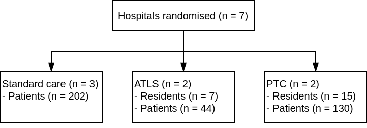

## Trial registration

This pilot study was registered with ClinicalTrials.gov (reg. no
NCT05417243).

## Corresponding author

Martin Gerdin Wärnberg (MGW)

Department of Global Public Health  
Karolinska Institutet  
171 77 Stockholm  
Sweden

<martin.gerdin@ki.se>  
+46 708 53 95 98 (mobile)

## Authors

##### Johanna Berg (JB)

Department of Global Public Health, Karolinska Institutet, Stockholm,
Sweden.

Emergency Medicine, Department of Internal and Emergency Medicine, Skåne
University Hospital, Malmö, Sweden.

##### Shamita Chatterjee (SC)

Department of Surgery, Institute of Post Graduate Medical Education and
Research, Kolkata, India.

##### Li Felländer-Tsai (LFT)

Division of Orthopaedics and Biotechnology, Department of Clinical
Science Intervention and Technology (CLINTEC), Karolinska Institutet,
Stockholm, Sweden.

Department of Reconstructive Orthopedics, Karolinska University
Hospital, Stockholm, Sweden.

##### Geeta Ghag (GG)

Department of Surgery, HBT Medical College And Dr. R N Cooper Municipal
General Hospital, Mumbai, India.

##### Monty Khajanchi (MK)

WHO Collaboration Centre for Research in Surgical Care Delivery in LMIC,
Mumbai, India.

Seth G. S. Medical College and K.E.M. Hospital, Mumbai, India.

##### Catherine Juillard (CJ)

Division of General Surgery, Department of Surgery, David Geffen School
of Medicine at UCLA, Los Angeles, California, United States of America.

##### Nobhojit Roy (NR)

WHO Collaborating Center for Research on Surgical Care Delivery in
LMICs, BARC Hospital, HBNI University, Mumbai, India.

Department of Global Public Health, Karolinska Institutet, Stockholm,
Sweden.

##### Rajdeep Singh (RS)

Department of Surgery, Maulana Azad Medical College, New Delhi, India.

##### Kapil Dev Soni (KDS)

Critical and Intensive Care, JPN Apex Trauma Center, All India Institute
of Medical Sciences, New Delhi, India.

##### Lovisa Strömmer (LS)

Division of Surgery, Department of Clinical Science, Intervention and
Technology (CLINTEC), Karolinska Institutet, Stockholm, Sweden.

Department of Surgery, Capio St Göran Hospital, Stockholm, Sweden.

##### Vipul Nandu

Department of Surgery, HBT Medical College And Dr. R N Cooper Municipal
General Hospital, Mumbai, India.

##### Debojit Basak

Project Research Scientist, Institute of Post Graduate Medical Education
and Research, Kolkata, India.

##### Tamal Khan

## Non-author contributors

Trauma life support Effectiveness Research Network (TERN) collaborators:

##### Prashant Bhandarkar (PB)

WHO collaboration Centre for Research in Surgical Care Delivery in LMIC,
Mumbai, India.

##### Anirban Chatterjee (AC)

Department of Orthopaedic Sciences, Medica Superspecialty Hospital,
Kolkata, India.

##### Chintamani (C)

Department of Surgery, Vardhman Mahavir Medical College and Safdarjung
Hospital, New Delhi, India.

##### Anita Gadgil (AG)

WHO collaboration Centre for Research in Surgical Care Delivery in LMIC,
Mumbai, India.

##### Marie Hasselberg (MH)

Department of Global Public Health, Karolinska Institutet, Stockholm,
Sweden.

##### Deepa Kizhakke Veetil (DKV)

Department of Surgery, Manipal Hospital, Dwarka, New Delhi.

##### Vineet Kumar (VK)

Department of Surgery, Lokmanya Tilak Municipal Medical College and
General Hospital, Mumbai, India.

##### Debabrata Kundu (DK)

Department of Surgery, Medical College Kolkata, Kolkata, India.

##### Anurag Mishra (AM)

Department of Surgery, Maulana Azad Medical College, New Delhi, India.

##### Priti Patil (PP)

WHO collaboration Centre for Research in Surgical Care Delivery in LMIC,
Mumbai, India.

##### Arun Prasad (AP)

Department of Surgery, Indraprastha Apollo Hospitals, New Delhi

##### Amit Roy (AR)

Department of Surgery, Sir Nil Ratan Sircar Medical College & Hospital,
Kolkata, India.

##### Siddarth David (SD)

Department of Global Public Health, Karolinska Institutet, Stockholm,
Sweden.

Doctors For You, Mumbai, India.

##### Harris Solomon (HS)

Department of Cultural Anthropology and the Duke Global Health
Institute, Duke University, Durham, USA.

##### Megha Tandon (MT)

Department of Surgery, Vardhman Mahavir Medical College and Safdarjung
Hospital, New Delhi, India.

## Keywords

Trauma management, Accident and emergency medicine, Education and
training.

<!--
## Word Count
4494
 -->

## Role of study sponsor and funders

The funding sources had no role in the design of this study nor during
its execution, analyses, interpretation of the data, or decision to
submit the results.

<!-- \newpage -->
<!-- Source main code to make global objects available in the text -->

# Abstract

**Importance** Trauma life support training programmes aim to improve
early trauma care but there is high-quality evidence to show that they
improve patient outcomes.

**Objective** To assess the feasibility of conducting a cluster
randomised controlled trial comparing the effect of Advanced Trauma Life
Support® (ATLS®) and Primary Trauma Care (PTC)
with standard care on patient outcomes.

**Design** A pilot pragmatic three-armed parallel, cluster randomised,
controlled trial between April 2022 and February 2023. Patient follow up
was 30 days.

**Setting** Tertiary care hospitals across metropolitan areas in India.

**Participants** Adult trauma patients and residents managing these
patients.

**Interventions** ATLS® or PTC training for residents in the
intervention arms.

**Main Outcomes and Measures** The feasibility outcomes were consent
rate, lost to follow up rate, pass rate, missing data rates, and
differences in distribution between observed and data extracted from
medical records. The primary patient outcome was all cause mortality at
30 days from the time of arrival to the emergency department.

**Results** Two hospitals were randomised to ATLS®, two to
PTC, and three to standard care. We included 376 patients and 22
residents. The percentage of patients who consented to follow up was 77%
and the percentage of residents who consented to training was 100%. The
lost to follow up rate was 14%. The pass rate was 100%. The missing data
was overall low for key variables. Data collected through observations
were similar to data extracted from medical records, but there was more
missing data in the extracted data. Twenty-two (16)% patients died
within 30 days in the standard care arm, one (4)% patients in the
ATLS® arm, and three (5)% patients in the PTC arm.

**Conclusions and Relevance** Conducting a full-scale cluster randomised
controlled trial comparing the effects of ATLS®, PTC, and
standard care on patient outcomes should be feasible after incorporating
key lessons from this pilot.

**Trial Registration** ClinicalTrials.gov (reg. no NCT05417243)

<!--
# Article Summary

Strengths and limitations of this study:

- Cluster randomized controlled trial comparing the effect of ATLS^®^, PTC and standard care on patient and provider outcomes.
- Prospective data collection with direct observations by dedicated research officers.
- Participating centers' heterogeneity may affect the study estimates and bias the results.
-->
# Introduction

Trauma, defined as the clinical entity composed of physical injury and
the body’s associated response, causes 4.3 millions deaths every
year1. Several trauma life support training programs have
been developed to improve the early management of patients as they
arrive at hospital by providing a structured framework to assessment and
treatment2–4.

The proprietary Advanced Trauma Life Support®
(ATLS®) and the low-cost alternative Primary Trauma Care
(PTC) are the most established trauma life support training programmes
with physicians trained in over 80 countries5,6.
Observational studies indicate that these programmes may improve patient
outcomes7, but there is no high quality evidence from
controlled trials to support this2–4.

Several studies, including at least two randomised controlled
trials8,9, show that ATLS® is associated with
improved provider skills2. Observational evidence indicates
that PTC also leads to improved provider skills4. The missing
link is then how, and if, these improved skills translate into improved
patient outcomes.

Systematic reviews call for trials in settings where these programmes
are not routinely implemented, but data needed to inform the planning of
such a trial is missing. We aimed to assess the feasibility of
conducting a cluster randomised controlled trial comparing
ATLS® and PTC with standard care, and to estimate probable
effect sizes and the intracluster correlation coefficient needed for the
sample size calculations of a full-scale trial.

<!-- add citation to scoping review of TQIP [@mciver_effect_2024]-->

# Methods

## Trial Design

We piloted a three-armed cluster randomised controlled
trial10. There were a standard care arm and two intervention
arms, ATLS® and PTC training. We collected data for four
months in all three arms, first during a one month observation phase and
then during a three month intervention phase (or continued observation
in the standard care arm). This design allowed us to assess outcomes
both as final values and as change from baseline.

## Study Setting

We conducted this pilot study in seven Indian tertiary hospitals across
metropolitan areas in India, where neither ATLS®, PTC, nor
any other trauma life support training program is routinely taught.

<!--
The trauma system is still developing, with
limited prehospital care, and the in hospital trauma mortality as well
as the proportion of preventable deaths remain high. Lack of standard
trauma training for healthcare providers, limited hospital resources,
inadequate processes of care, overcrowding emergency departments - are
some of the factors that contribute to the high mortality and
morbidity. During recent years efforts have been made to improve
hospital trauma care, through capacity building for trained trauma
care providers, augmenting facilities, and developing care protocols
within the hospitals. 
-->

## Standard Care

Standard care varies across hospitals in India, but most surgical and
emergency medicine departments in India organise their physicians in
units. These units typically include three faculty members and three to
twelve residents, who are assigned a specific day of the week when they
manage the emergency department. In the emergency department, trauma
patients are initially assessed by first- or second-year residents who
also resuscitate patients, perform interventions and refer patients for
imaging or other investigations. Compared with other settings where a
trauma team approach is adopted, nurses and other healthcare
professionals are only involved to a limited extent during the initial
management.

## Intervention

In each intervention arm the residents in one or two units were trained
in either ATLS® or PTC. For the purpose of this pilot study,
our target was to train a minimum of 75% of residents in each unit. We
did not train the units’ faculty, because they are typically not
directly involved in the initial management of trauma patients. The
ATLS® training was conducted in an ATLS® certified
training centre in Mumbai, according to the standard ATLS®
curriculum5. The PTC training was conducted in New Delhi,
according to the standard PTC curriculum6. We did not modify
or adapt the delivery or content of these programs during this pilot
study.

## Eligibility Criteria for Cluster and Participants

### Hospitals

We included tertiary care hospitals in metropolitan areas in India that
admitted more than 400 adult patients with trauma each year, and that
had operation theatres, X-ray, CT, and ultrasound facilities, and blood
bank available around the clock.

### Clusters

We defined a cluster as one or more units of physicians providing trauma
care in the emergency department of Indian tertiary care hospitals. To
be eligible, units could have no more than 25% of their physicians
trained in either ATLS®, PTC, or similar training programs
before the start of the pilot study. Those residents who had received
training in the last five years were considered as trained. The figure
of 25% was decided through consensus in the research team, to balance
feasibility and contamination of results. The principal investigator at
each hospital selected the units for training. We randomised on the
hospital level to avoid contamination between intervention arms and the
standard care arms.

### Residents

Resident doctors doing their speciality training in surgery or emergency
medicine managing trauma patients in the emergency department and who
were expected to remain in the participating hospitals for at least one
year from the time of the training. Consent was sought from the
residents in each of the intervention groups before they underwent the
ATLS® or PTC training.

### Patients

All adults (15 years or older) who presented to the emergency department
at participating hospitals with a history of trauma when a designated
unit was on duty. History of trauma was defined as having any of the
external causes of morbidity and mortality listed in block V01-Y36,
chapter XX of the International Classification of Disease version 10
(ICD-10) codebook as reason for presenting.

## Outcomes

We measured a large number of outcomes to help plan and assess the
feasibility of a full scale trial. A complete list of outcomes is
available as Supplementary Materials. Our main outcomes were:

-   Consent rate of patients and residents. This was equal to the
    percentage of patients or residents who consented to be included,
    out of the total number of eligible patients or residents.
-   Lost to follow up rate. This applied only to patients and was equal
    to the percentage of patients whom did not complete 30 day follow
    up, out of all enrolled patients.
-   Pass rate. This applied only to residents in the intervention arms
    and was equal the percentage of residents that passed the training
    programme, out of the total number of trained residents.
-   Missing data rate. This applied to each outcome and variable and was
    equal to the percentage of missing values.
-   Differences in distributions of observed and extracted data. This
    applied to each outcome and variable and compared the distributions
    of data collected by observations versus extracted from hospital
    records.
-   All cause and in-hospital mortality within 30 days from the time of
    arrival to the emergency department among patients, measured and
    compared across trial arms as both final values and as change from
    baseline.

<!--The primary outcome and most secondary outcome were assessed and compared both as final values and as change from baseline. All outcomes that pertain to the individual participant level are detailed in Supplemental Material 1. We decided to include a large number of outcomes, including some more exploratory, so that we could test their feasibility and relevance. -->

## Participant Timeline and Inclusion

### Patients

Arriving patients were screened for eligibility and consented, if
conscious. Unconscious patients were consented by the patient’s
representative. This proxy consent was reaffirmed by the patient, on
regaining consciousness. We followed up patients at 24 hours after
arrival at the emergency department, and up to 30 days after arrival at
the emergency department.

### Residents

Participating units were screened for eligibility once hospitals
confirmed their participation. All residents in these units were
approached to consent to training if their hospital was randomised to
either of the intervention arms. The training was conducted
approximately one month after the study started in that hospital.

## Sample size

We did not conduct a formal power calculation for this pilot study, as
the primary aim was to assess feasibility. The time period was dictated
by budget and time constraints.

## Allocation and blincing

We used simple randomisation implemented using sealed envelopes to
allocate sites to trial arms. We did not blind investigators, residents
or patients to the interventions.

## Data Collection

Data was collected over a four-month period. A research officer
collected data on all patients who presented on the days and shifts when
participating residents were assigned to trauma care. The research
officers observed care and interviewed residents and patients, and also
extracted data from the hospital records. We followed up admitted
patients for their complications and other in-hospital outcome measures.
Patients who were not admitted were followed up telephonically for
mortality outcomes and quality of life outcomes.

## Variables

The research officers collected data on demographics, time of injury to
arrival at the participating hospital, time to recording vital signs,
vital signs, times to and management details including imaging and
surgery, and details of any injury sustained. For a subset of patients
we also extracted data from medical records, to be able to compare their
distributions with directly observed
data.<!--Supplemental Material 2 contains a full variable list, with definitions.-->

## Patient and public involvement

We conducted community consultations to collect inputs from patients,
their caregivers, patient groups, and resident doctors to be used in the
selection of outcome measures and implementation of the full-scale
trial. The results of these consultations will be published separately.

<!--
## Data management
We used the online data collection tool KoboToolbox [@KoboToolbox], accessible only over a virtual private network (VPN), for each participating hospital to upload pseudonymised data to secure servers. Data validation techniques such as restricted values or values within a specific range were used to avoid ambiguous data entries and ensure the validity of the data. Ambiguous responses and errors were resolved after discussion with the core team during weekly meetings. An instruction manual or codebook for data variables was prepared to ensure consistency in data entry. This manual was referred to during the project data collection and variable descriptions were visible for each variable in the online data collection tool. Pseudonymised data were stored at the centralised server. The data were only accessible by the project's principal investigator or by delegation by the project principal investigator.
-->

## Data monitoring

We conducted weekly online meetings to monitor the study and data
collection. We conducted one interim analysis approximately halfway
through the study, and decided to complete the study as residents and
patients were consenting to be included in the study and key variables
including mortality outcomes could be collected. We did not use a data
monitoring committee.

## Statistical Methods

We analysed all data using descriptive statistics and did not perform
any formal hypothesis11. Quantitative variables are
summarised as mean +/- standard deviation, median, interquartile range
and range. Qualitative variables are presented as absolute numbers and
percentages. We used an empty generalised linear mixed model
<!-- see [@Sommet2017] --> to estimate the intracluster correlation
coefficient.

We compared patients outcomes in all possible combinations of trial
arms. In each combination we compared both differences in final values
and differences in change from baseline. For the intervention arms the
change from baseline was calculated as the difference between the one
month period of data collection before the training was undertaken and
the three month period after the training. For the control arm the data
collection period was four months and the difference from baseline was
calculated as the difference between the first one month and the
following three months.

Within each combination of trial arms we had planned to conduct subgroup
analyses of men, women, blunt multisystem trauma, penetrating trauma,
shock, severe traumatic brain injury, and elderly. These subgroups were
however too small to allow for meaningful analyses, and are therefore
reported descriptively.

<!--We calculated both absolute and relative differences for each
comparison, along with 75, 85, and 95% confidence intervals. We used an empirical bootstrap procedure with 1000 draws to estimate these confidence intervals.-->

## Ethics and Dissemination

We were granted research ethics approval from the institutional ethics
committees at each participating hospital.

# Results

We enrolled 376 trauma patients from 7 participating centres between
April 2022 and February 2023. The standard care arm 202 patients, the
ATLS® arm enrolled 44 patients, and the PTC arm 130 patients.
We trained a total of 22 residents, 7 in ATLS®, and 15 in
PTC.

The study flow diagram is shown in Figure @ref(fig:flow-diagram) and
patient sample characteristics across trial arms are shown in Table
@ref(tab:sample-characteristics). Overall, the number of females were 86
(23%), the median (IQR) age was 33 (24, 46) years, and the median ISS
(IQR) was 1 (0, 5). A total of 32 (10%) patients died within 30 days
after arrival to the emergency department.

Study flow diagram. Abbreviations: ATLS, Advanced Trauma Life Support;
PTC, Primary Trauma Care.

<table class="gt_table" data-quarto-disable-processing="false" data-quarto-bootstrap="false">
  <caption>Patient sample characteristics</caption>
  <thead>
    <tr class="gt_col_headings">
      <th class="gt_col_heading gt_columns_bottom_border gt_left" rowspan="1" colspan="1" scope="col" id="&lt;span class='gt_from_md'&gt;&lt;strong&gt;Characteristic&lt;/strong&gt;&lt;/span&gt;&lt;span class=&quot;gt_footnote_marks&quot; style=&quot;white-space:nowrap;font-style:italic;font-weight:normal;line-height: 0;&quot;&gt;&lt;sup&gt;1&lt;/sup&gt;&lt;/span&gt;"><strong>Characteristic</strong>1</th>
      <th class="gt_col_heading gt_columns_bottom_border gt_center" rowspan="1" colspan="1" scope="col" id="&lt;span class='gt_from_md'&gt;&lt;strong&gt;Standard care&lt;/strong&gt;&lt;br /&gt;&#10;N = 202&lt;/span&gt;"><strong>Standard care</strong> 
N = 202</th>
      <th class="gt_col_heading gt_columns_bottom_border gt_center" rowspan="1" colspan="1" scope="col" id="&lt;span class='gt_from_md'&gt;&lt;strong&gt;ATLS&lt;/strong&gt;&lt;br /&gt;&#10;N = 44&lt;/span&gt;"><strong>ATLS</strong> 
N = 44</th>
      <th class="gt_col_heading gt_columns_bottom_border gt_center" rowspan="1" colspan="1" scope="col" id="&lt;span class='gt_from_md'&gt;&lt;strong&gt;PTC&lt;/strong&gt;&lt;br /&gt;&#10;N = 130&lt;/span&gt;"><strong>PTC</strong> 
N = 130</th>
      <th class="gt_col_heading gt_columns_bottom_border gt_center" rowspan="1" colspan="1" scope="col" id="&lt;span class='gt_from_md'&gt;&lt;strong&gt;Overall&lt;/strong&gt;&lt;br /&gt;&#10;N = 376&lt;/span&gt;"><strong>Overall</strong> 
N = 376</th>
    </tr>
  </thead>
  <tbody class="gt_table_body">
    <tr><td headers="label" class="gt_row gt_left">Age, years, median (IQR)</td>
<td headers="stat_1" class="gt_row gt_center">35 (25, 47)</td>
<td headers="stat_2" class="gt_row gt_center">40 (30, 57)</td>
<td headers="stat_3" class="gt_row gt_center">30 (22, 38)</td>
<td headers="stat_0" class="gt_row gt_center">33 (24, 46)</td></tr>
    <tr><td headers="label" class="gt_row gt_left">Elderly, n (%)</td>
<td headers="stat_1" class="gt_row gt_center">15 (7%)</td>
<td headers="stat_2" class="gt_row gt_center">6 (14%)</td>
<td headers="stat_3" class="gt_row gt_center">5 (4%)</td>
<td headers="stat_0" class="gt_row gt_center">26 (7%)</td></tr>
    <tr><td headers="label" class="gt_row gt_left">Sex, n (%)</td>
<td headers="stat_1" class="gt_row gt_center"> </td>
<td headers="stat_2" class="gt_row gt_center"> </td>
<td headers="stat_3" class="gt_row gt_center"> </td>
<td headers="stat_0" class="gt_row gt_center"> </td></tr>
    <tr><td headers="label" class="gt_row gt_left">    Male</td>
<td headers="stat_1" class="gt_row gt_center">160 (79%)</td>
<td headers="stat_2" class="gt_row gt_center">33 (75%)</td>
<td headers="stat_3" class="gt_row gt_center">97 (75%)</td>
<td headers="stat_0" class="gt_row gt_center">290 (77%)</td></tr>
    <tr><td headers="label" class="gt_row gt_left">    Female</td>
<td headers="stat_1" class="gt_row gt_center">42 (21%)</td>
<td headers="stat_2" class="gt_row gt_center">11 (25%)</td>
<td headers="stat_3" class="gt_row gt_center">33 (25%)</td>
<td headers="stat_0" class="gt_row gt_center">86 (23%)</td></tr>
    <tr><td headers="label" class="gt_row gt_left">Dominating injury type, n (%)</td>
<td headers="stat_1" class="gt_row gt_center"> </td>
<td headers="stat_2" class="gt_row gt_center"> </td>
<td headers="stat_3" class="gt_row gt_center"> </td>
<td headers="stat_0" class="gt_row gt_center"> </td></tr>
    <tr><td headers="label" class="gt_row gt_left">    Penetrating</td>
<td headers="stat_1" class="gt_row gt_center">13 (6%)</td>
<td headers="stat_2" class="gt_row gt_center">3 (7%)</td>
<td headers="stat_3" class="gt_row gt_center">1 (1%)</td>
<td headers="stat_0" class="gt_row gt_center">17 (5%)</td></tr>
    <tr><td headers="label" class="gt_row gt_left">    Blunt</td>
<td headers="stat_1" class="gt_row gt_center">189 (94%)</td>
<td headers="stat_2" class="gt_row gt_center">41 (93%)</td>
<td headers="stat_3" class="gt_row gt_center">129 (99%)</td>
<td headers="stat_0" class="gt_row gt_center">359 (95%)</td></tr>
    <tr><td headers="label" class="gt_row gt_left">Blunt multisystem trauma, n (%)</td>
<td headers="stat_1" class="gt_row gt_center">2 (1%)</td>
<td headers="stat_2" class="gt_row gt_center">2 (5%)</td>
<td headers="stat_3" class="gt_row gt_center">6 (5%)</td>
<td headers="stat_0" class="gt_row gt_center">10 (3%)</td></tr>
    <tr><td headers="label" class="gt_row gt_left">Severe traumatic brain injury, n (%)</td>
<td headers="stat_1" class="gt_row gt_center">10 (5%)</td>
<td headers="stat_2" class="gt_row gt_center">1 (2%)</td>
<td headers="stat_3" class="gt_row gt_center">5 (4%)</td>
<td headers="stat_0" class="gt_row gt_center">16 (4%)</td></tr>
    <tr><td headers="label" class="gt_row gt_left">    Missing</td>
<td headers="stat_1" class="gt_row gt_center">1</td>
<td headers="stat_2" class="gt_row gt_center">0</td>
<td headers="stat_3" class="gt_row gt_center">0</td>
<td headers="stat_0" class="gt_row gt_center">1</td></tr>
    <tr><td headers="label" class="gt_row gt_left">Shock, n (%)</td>
<td headers="stat_1" class="gt_row gt_center">4 (2%)</td>
<td headers="stat_2" class="gt_row gt_center">2 (5%)</td>
<td headers="stat_3" class="gt_row gt_center">4 (3%)</td>
<td headers="stat_0" class="gt_row gt_center">10 (3%)</td></tr>
    <tr><td headers="label" class="gt_row gt_left">    Missing</td>
<td headers="stat_1" class="gt_row gt_center">7</td>
<td headers="stat_2" class="gt_row gt_center">3</td>
<td headers="stat_3" class="gt_row gt_center">4</td>
<td headers="stat_0" class="gt_row gt_center">14</td></tr>
    <tr><td headers="label" class="gt_row gt_left">Respiratory rate, breaths per minute, median (IQR)</td>
<td headers="stat_1" class="gt_row gt_center">20 (18, 22)</td>
<td headers="stat_2" class="gt_row gt_center">21 (20, 24)</td>
<td headers="stat_3" class="gt_row gt_center">21 (20, 24)</td>
<td headers="stat_0" class="gt_row gt_center">20 (19, 23)</td></tr>
    <tr><td headers="label" class="gt_row gt_left">    Missing</td>
<td headers="stat_1" class="gt_row gt_center">7</td>
<td headers="stat_2" class="gt_row gt_center">0</td>
<td headers="stat_3" class="gt_row gt_center">5</td>
<td headers="stat_0" class="gt_row gt_center">12</td></tr>
    <tr><td headers="label" class="gt_row gt_left">Oxygen saturation, %, median (IQR)</td>
<td headers="stat_1" class="gt_row gt_center">98 (97, 99)</td>
<td headers="stat_2" class="gt_row gt_center">98 (97, 99)</td>
<td headers="stat_3" class="gt_row gt_center">98 (98, 99)</td>
<td headers="stat_0" class="gt_row gt_center">98 (97, 99)</td></tr>
    <tr><td headers="label" class="gt_row gt_left">    Missing</td>
<td headers="stat_1" class="gt_row gt_center">1</td>
<td headers="stat_2" class="gt_row gt_center">1</td>
<td headers="stat_3" class="gt_row gt_center">0</td>
<td headers="stat_0" class="gt_row gt_center">2</td></tr>
    <tr><td headers="label" class="gt_row gt_left">Heart rate, beats per minute, median (IQR)</td>
<td headers="stat_1" class="gt_row gt_center">86 (80, 96)</td>
<td headers="stat_2" class="gt_row gt_center">87 (73, 100)</td>
<td headers="stat_3" class="gt_row gt_center">90 (76, 104)</td>
<td headers="stat_0" class="gt_row gt_center">86 (78, 100)</td></tr>
    <tr><td headers="label" class="gt_row gt_left">    Missing</td>
<td headers="stat_1" class="gt_row gt_center">1</td>
<td headers="stat_2" class="gt_row gt_center">1</td>
<td headers="stat_3" class="gt_row gt_center">1</td>
<td headers="stat_0" class="gt_row gt_center">3</td></tr>
    <tr><td headers="label" class="gt_row gt_left">Systolic blood pressure, mmHg, median (IQR)</td>
<td headers="stat_1" class="gt_row gt_center">123 (112, 135)</td>
<td headers="stat_2" class="gt_row gt_center">124 (113, 131)</td>
<td headers="stat_3" class="gt_row gt_center">122 (111, 136)</td>
<td headers="stat_0" class="gt_row gt_center">123 (112, 135)</td></tr>
    <tr><td headers="label" class="gt_row gt_left">    Missing</td>
<td headers="stat_1" class="gt_row gt_center">7</td>
<td headers="stat_2" class="gt_row gt_center">3</td>
<td headers="stat_3" class="gt_row gt_center">4</td>
<td headers="stat_0" class="gt_row gt_center">14</td></tr>
    <tr><td headers="label" class="gt_row gt_left">Glasgow Coma Scale, median (IQR)</td>
<td headers="stat_1" class="gt_row gt_center">15 (15, 15)</td>
<td headers="stat_2" class="gt_row gt_center">15 (15, 15)</td>
<td headers="stat_3" class="gt_row gt_center">15 (15, 15)</td>
<td headers="stat_0" class="gt_row gt_center">15 (15, 15)</td></tr>
    <tr><td headers="label" class="gt_row gt_left">    Missing</td>
<td headers="stat_1" class="gt_row gt_center">2</td>
<td headers="stat_2" class="gt_row gt_center">1</td>
<td headers="stat_3" class="gt_row gt_center">0</td>
<td headers="stat_0" class="gt_row gt_center">3</td></tr>
    <tr><td headers="label" class="gt_row gt_left">Injury Severity Score, median (IQR)</td>
<td headers="stat_1" class="gt_row gt_center">1 (0, 4)</td>
<td headers="stat_2" class="gt_row gt_center">3 (1, 4)</td>
<td headers="stat_3" class="gt_row gt_center">2 (0, 5)</td>
<td headers="stat_0" class="gt_row gt_center">1 (0, 5)</td></tr>
  </tbody>
  
  <tfoot class="gt_footnotes">
    <tr>
      <td class="gt_footnote" colspan="5">1 ATLS = Advanced Trauma Life Support; PTC = Prehospital Trauma Care</td>
    </tr>
  </tfoot>
</table>

## Outcomes

The percentage of patients who consented to follow up was 77% and the
percentage of residents who consented to training was 100%. The lost to
follow up rate was 14%. The pass rate was 100%. The missing data rate
ranged from 0 to 98, with details for selected variables shown in Table
(tab:sample-characteristics). The differences in distributions between
observed data and data extracted from medical records, for selected
variables that were collected through observation or interview, are
shown in Table (tab:observed-vs-extracted). Overall, the data were
similarly distributed, but there were considerably more missing values
in extracted data compared to observed data.

<table class="gt_table" data-quarto-disable-processing="false" data-quarto-bootstrap="false">
  <caption>Differences in distributions between directly observed data and data extracted from medical records, for selected variables that were collected through observation or interview.</caption>
  <thead>
    <tr class="gt_col_headings">
      <th class="gt_col_heading gt_columns_bottom_border gt_left" rowspan="1" colspan="1" scope="col" id="&lt;span class='gt_from_md'&gt;&lt;strong&gt;Characteristic&lt;/strong&gt;&lt;/span&gt;"><strong>Characteristic</strong></th>
      <th class="gt_col_heading gt_columns_bottom_border gt_center" rowspan="1" colspan="1" scope="col" id="&lt;span class='gt_from_md'&gt;&lt;strong&gt;Directly observed&lt;/strong&gt;&lt;br /&gt;&#10;N = 55&lt;/span&gt;&lt;span class=&quot;gt_footnote_marks&quot; style=&quot;white-space:nowrap;font-style:italic;font-weight:normal;line-height: 0;&quot;&gt;&lt;sup&gt;1&lt;/sup&gt;&lt;/span&gt;"><strong>Directly observed</strong> 
N = 551</th>
      <th class="gt_col_heading gt_columns_bottom_border gt_center" rowspan="1" colspan="1" scope="col" id="&lt;span class='gt_from_md'&gt;&lt;strong&gt;Medical records&lt;/strong&gt;&lt;br /&gt;&#10;N = 55&lt;/span&gt;&lt;span class=&quot;gt_footnote_marks&quot; style=&quot;white-space:nowrap;font-style:italic;font-weight:normal;line-height: 0;&quot;&gt;&lt;sup&gt;1&lt;/sup&gt;&lt;/span&gt;"><strong>Medical records</strong> 
N = 551</th>
    </tr>
  </thead>
  <tbody class="gt_table_body">
    <tr><td headers="label" class="gt_row gt_left">Age, years</td>
<td headers="stat_1" class="gt_row gt_center">34 (27, 48)</td>
<td headers="stat_2" class="gt_row gt_center">34 (25, 50)</td></tr>
    <tr><td headers="label" class="gt_row gt_left">    Missing</td>
<td headers="stat_1" class="gt_row gt_center">0</td>
<td headers="stat_2" class="gt_row gt_center">22</td></tr>
    <tr><td headers="label" class="gt_row gt_left">Sex</td>
<td headers="stat_1" class="gt_row gt_center"> </td>
<td headers="stat_2" class="gt_row gt_center"> </td></tr>
    <tr><td headers="label" class="gt_row gt_left">    Female</td>
<td headers="stat_1" class="gt_row gt_center">10 (18%)</td>
<td headers="stat_2" class="gt_row gt_center">6 (18%)</td></tr>
    <tr><td headers="label" class="gt_row gt_left">    Male</td>
<td headers="stat_1" class="gt_row gt_center">45 (82%)</td>
<td headers="stat_2" class="gt_row gt_center">27 (82%)</td></tr>
    <tr><td headers="label" class="gt_row gt_left">    Missing</td>
<td headers="stat_1" class="gt_row gt_center">0</td>
<td headers="stat_2" class="gt_row gt_center">22</td></tr>
    <tr><td headers="label" class="gt_row gt_left">Dominating injury type</td>
<td headers="stat_1" class="gt_row gt_center"> </td>
<td headers="stat_2" class="gt_row gt_center"> </td></tr>
    <tr><td headers="label" class="gt_row gt_left">    Blunt</td>
<td headers="stat_1" class="gt_row gt_center">52 (95%)</td>
<td headers="stat_2" class="gt_row gt_center">29 (91%)</td></tr>
    <tr><td headers="label" class="gt_row gt_left">    Penetrating</td>
<td headers="stat_1" class="gt_row gt_center">3 (5%)</td>
<td headers="stat_2" class="gt_row gt_center">3 (9%)</td></tr>
    <tr><td headers="label" class="gt_row gt_left">    Missing</td>
<td headers="stat_1" class="gt_row gt_center">0</td>
<td headers="stat_2" class="gt_row gt_center">23</td></tr>
    <tr><td headers="label" class="gt_row gt_left">Respiratory rate, breaths per minute</td>
<td headers="stat_1" class="gt_row gt_center">21 (18, 24)</td>
<td headers="stat_2" class="gt_row gt_center">18 (16, 20)</td></tr>
    <tr><td headers="label" class="gt_row gt_left">    Missing</td>
<td headers="stat_1" class="gt_row gt_center">0</td>
<td headers="stat_2" class="gt_row gt_center">37</td></tr>
    <tr><td headers="label" class="gt_row gt_left">Oxygen saturation, %</td>
<td headers="stat_1" class="gt_row gt_center">98 (98, 99)</td>
<td headers="stat_2" class="gt_row gt_center">98 (97, 100)</td></tr>
    <tr><td headers="label" class="gt_row gt_left">    Missing</td>
<td headers="stat_1" class="gt_row gt_center">0</td>
<td headers="stat_2" class="gt_row gt_center">29</td></tr>
    <tr><td headers="label" class="gt_row gt_left">Heart rate, beats per minute</td>
<td headers="stat_1" class="gt_row gt_center">85 (80, 98)</td>
<td headers="stat_2" class="gt_row gt_center">87 (84, 93)</td></tr>
    <tr><td headers="label" class="gt_row gt_left">    Missing</td>
<td headers="stat_1" class="gt_row gt_center">0</td>
<td headers="stat_2" class="gt_row gt_center">19</td></tr>
    <tr><td headers="label" class="gt_row gt_left">Systolic blood pressure, mmHg</td>
<td headers="stat_1" class="gt_row gt_center">123 (112, 136)</td>
<td headers="stat_2" class="gt_row gt_center">118 (110, 128)</td></tr>
    <tr><td headers="label" class="gt_row gt_left">    Missing</td>
<td headers="stat_1" class="gt_row gt_center">1</td>
<td headers="stat_2" class="gt_row gt_center">18</td></tr>
  </tbody>
  
  <tfoot class="gt_footnotes">
    <tr>
      <td class="gt_footnote" colspan="3">1 Median (Q1, Q3); n (%)</td>
    </tr>
  </tfoot>
</table>

After training, a total of 22 (16%) patients in the standard care arm
died within 30 days, compared to 1 (4%) patients in the ATLS®
arm and 3 (5%) patients in the PTC arm. The corresponding figures for
in-hospital mortality were 19 (12%)%, 1 (4%)%, and 3 (4%)%, as shown in
Table @ref(tab:outcomes). Overall, both in-hospital and 30-day mortality
were substantially lower in the ATLS® and PTC arms compared
to the standard care arm, but the absolute numbers of deaths in the ATLS
and PTC arms were very small. The results for all other outcomes are
shown in Supplementary Materials.

<table class="gt_table" data-quarto-disable-processing="false" data-quarto-bootstrap="false">
  <caption>Mortality after training by the trial arms standard care, Advanced Trauma Life Support (ATLS) and Primary Trauma Care (PTC)</caption>
  <thead>
    <tr class="gt_col_headings gt_spanner_row">
      <th class="gt_col_heading gt_columns_bottom_border gt_left" rowspan="2" colspan="1" scope="col" id="&lt;span class='gt_from_md'&gt;&lt;strong&gt;Outcome&lt;/strong&gt;&lt;/span&gt;"><strong>Outcome</strong></th>
      <th class="gt_center gt_columns_top_border gt_column_spanner_outer" rowspan="1" colspan="3" scope="colgroup" id="&lt;span class='gt_from_md'&gt;&lt;strong&gt;Arms&lt;/strong&gt;&lt;/span&gt;">
        <strong>Arms</strong>
      </th>
      <th class="gt_center gt_columns_top_border gt_column_spanner_outer" rowspan="1" colspan="3" scope="colgroup" id="&lt;span class='gt_from_md'&gt;&lt;strong&gt;Differences&lt;/strong&gt;&lt;/span&gt;">
        <strong>Differences</strong>
      </th>
    </tr>
    <tr class="gt_col_headings">
      <th class="gt_col_heading gt_columns_bottom_border gt_center" rowspan="1" colspan="1" scope="col" id="&lt;span class='gt_from_md'&gt;&lt;strong&gt;Standard care&lt;/strong&gt;&lt;br /&gt;&#10;N = 161&lt;/span&gt;&lt;span class=&quot;gt_footnote_marks&quot; style=&quot;white-space:nowrap;font-style:italic;font-weight:normal;line-height: 0;&quot;&gt;&lt;sup&gt;1&lt;/sup&gt;&lt;/span&gt;"><strong>Standard care</strong> 
N = 1611</th>
      <th class="gt_col_heading gt_columns_bottom_border gt_center" rowspan="1" colspan="1" scope="col" id="&lt;span class='gt_from_md'&gt;&lt;strong&gt;ATLS&lt;/strong&gt;&lt;br /&gt;&#10;N = 28&lt;/span&gt;&lt;span class=&quot;gt_footnote_marks&quot; style=&quot;white-space:nowrap;font-style:italic;font-weight:normal;line-height: 0;&quot;&gt;&lt;sup&gt;1&lt;/sup&gt;&lt;/span&gt;"><strong>ATLS</strong> 
N = 281</th>
      <th class="gt_col_heading gt_columns_bottom_border gt_center" rowspan="1" colspan="1" scope="col" id="&lt;span class='gt_from_md'&gt;&lt;strong&gt;PTC&lt;/strong&gt;&lt;br /&gt;&#10;N = 73&lt;/span&gt;&lt;span class=&quot;gt_footnote_marks&quot; style=&quot;white-space:nowrap;font-style:italic;font-weight:normal;line-height: 0;&quot;&gt;&lt;sup&gt;1&lt;/sup&gt;&lt;/span&gt;"><strong>PTC</strong> 
N = 731</th>
      <th class="gt_col_heading gt_columns_bottom_border gt_center" rowspan="1" colspan="1" scope="col" id="&lt;span class='gt_from_md'&gt;&lt;strong&gt;Standard care vs. ATLS&lt;/strong&gt;&lt;/span&gt;"><strong>Standard care vs. ATLS</strong></th>
      <th class="gt_col_heading gt_columns_bottom_border gt_center" rowspan="1" colspan="1" scope="col" id="&lt;span class='gt_from_md'&gt;&lt;strong&gt;Standard care vs. PTC&lt;/strong&gt;&lt;/span&gt;"><strong>Standard care vs. PTC</strong></th>
      <th class="gt_col_heading gt_columns_bottom_border gt_center" rowspan="1" colspan="1" scope="col" id="&lt;span class='gt_from_md'&gt;&lt;strong&gt;ATLS vs. PTC&lt;/strong&gt;&lt;/span&gt;"><strong>ATLS vs. PTC</strong></th>
    </tr>
  </thead>
  <tbody class="gt_table_body">
    <tr><td headers="label" class="gt_row gt_left">30 day mortality</td>
<td headers="stat_1_1" class="gt_row gt_center">22 (16%)</td>
<td headers="stat_2_1" class="gt_row gt_center">1 (3.8%)</td>
<td headers="stat_3_1" class="gt_row gt_center">3 (4.9%)</td>
<td headers="estimate_2" class="gt_row gt_center">12%</td>
<td headers="estimate_3" class="gt_row gt_center">11%</td>
<td headers="estimate_4" class="gt_row gt_center">-1.1%</td></tr>
    <tr><td headers="label" class="gt_row gt_left">    Unknown</td>
<td headers="stat_1_1" class="gt_row gt_center">26</td>
<td headers="stat_2_1" class="gt_row gt_center">2</td>
<td headers="stat_3_1" class="gt_row gt_center">12</td>
<td headers="estimate_2" class="gt_row gt_center"> </td>
<td headers="estimate_3" class="gt_row gt_center"> </td>
<td headers="estimate_4" class="gt_row gt_center"> </td></tr>
    <tr><td headers="label" class="gt_row gt_left">In-hospital mortality</td>
<td headers="stat_1_1" class="gt_row gt_center">19 (12%)</td>
<td headers="stat_2_1" class="gt_row gt_center">1 (3.7%)</td>
<td headers="stat_3_1" class="gt_row gt_center">3 (4.1%)</td>
<td headers="estimate_2" class="gt_row gt_center">8.2%</td>
<td headers="estimate_3" class="gt_row gt_center">7.8%</td>
<td headers="estimate_4" class="gt_row gt_center">-0.41%</td></tr>
    <tr><td headers="label" class="gt_row gt_left">    Unknown</td>
<td headers="stat_1_1" class="gt_row gt_center">2</td>
<td headers="stat_2_1" class="gt_row gt_center">1</td>
<td headers="stat_3_1" class="gt_row gt_center">0</td>
<td headers="estimate_2" class="gt_row gt_center"> </td>
<td headers="estimate_3" class="gt_row gt_center"> </td>
<td headers="estimate_4" class="gt_row gt_center"> </td></tr>
  </tbody>
  
  <tfoot class="gt_footnotes">
    <tr>
      <td class="gt_footnote" colspan="7">1 n (%)</td>
    </tr>
  </tfoot>
</table>

# Discussion

We show that it is feasible to conduct and collect data for a cluster
randomized controlled trial comparing ATLS® with PTC and
standard care. Missing data were low for key variables, including the
primary outcome and many secondary outcomes. Some variables, especially
cause of death and complications (reported in Supplementary materials)
had very high missing data rates and may not be feasible to include in a
full-scale trial, or require different data collection methods.
Similarly, the missing data was substantially higher when data was
extracted from medical records instead of being directly observed, but
the data

<!-- Should we include dependency at discharge, for example using the
Modified Oxford Handicap Scale used in @Roberts2013?-->

We found that the ATLS® and PTC arms had lower 30-day
mortality compared to the PTC and standard care arms. These findings
hints towards a potential effect of training physicians in trauma life
support, but it is important to note that this pilot study was not
powered to detect any differences in outcomes. The arms differed
considerably in sample size, with the ATLS® arm having the
smallest sample size. This difference most likely resulted from the
randomisation process with a small number of heterogeneous clusters.
This heterogeneity highlights the importance of taken different cluster
sizes into account in the design of the full scale trial.

All-cause 30-day mortality was missing in 14% of patients. This may
appear high, especially compared to for example the CRASH-2 and REACT-2
trials, which report missing primary outcome in less than 0.01% of
patients12,13. Like many other trauma trials, both CRASH-2
and REACT-2 used in-hospital mortality as their primary outcome measure,
whereas we attempted to follow up patients after discharge. Our missing
data rate for in-hospital mortality was only 1%, comparable to previous
trials.

<!-- Consider discussing non-inferiority vs superiority. -->

During the course of this pilot we deviated from the protocol in several
ways, and provide a detailed list as Supplementary material. Some key
limitations of this pilot and therefore lessons to be learned and
factored into the design of the full-scale trial include the lower than
expected enrolment rates of some centres, centre specific management
routines, and difficulties in collecting data on complications and cause
of death.

We minimised the impact of the lower than expected enrolment rates by
including a seventh centre, but on-site observations of patient volumes
are likely to be needed for the full-scale trial. We decided to be
pragmatic in selecting which residents to train and how to structure the
data collection depending on how and by whom patients were initially
managed, but this flexibility will need to be built into the full-scale
trial protocol. Finally, we found that data on complications and cause
of death were hard to identify and therefore the full-scale trial will
need to include longer training of research officers.

<!-- Consider discussing waiver of informed consent for initial 
data collection -->

Previous studies on the effect of in-hospital trauma life support
training on patient outcomes are observational or quasi-experimental
without a control group, with heterogeneous results14–18.
Studies from Trinidad and Tobago, El Salvador, Rwanda, and Cambodia
found no significant effect on patient mortality after implementing
in-hospital trauma life support training14–17, whereas one
study from China that included 820 patients found a significant
reduction in mortality, from 20 to 15%, after implementing
ATLS®18.

We conclude that conducting a full-scale cluster randomised trial should
be feasible after incorporating the lessons of this pilot.

# Contributorship statement

<!--
MGW conceived of the study. AG, AM, CJ, DKV, HS, JB, KDS, LFT, LS, MH,
MGW, MK, NR, PB, PP, RS, SD, and VK contributed to the design of the
study. DKV, KDS, MK, and MGW drafted the first version of the
protocol. AG, HS, and SD drafted the first version of the patient and
public involvement activities. JB and PP drafted the first versions of
the data management sections and wrote the data management plan. PB
and PP drafted the first versions of the statistical analysis
section. AG, AM, CJ, DKV, HS, JB, KDS, LFT, LS, MH, MGW, MK, NR, PB,
PP, RS, SC, SD, and VK contributed to the refinement of the
protocol. AR, AC, C, DK, GG, MK, MT, and VK are representatives of
prospective participating hospitals.
-->

# Competing Interests

Several authors are ATLS® and/or PTC instructors.

# Funding

Doctors for You through grants awarded to Karolinska Institutet by the
Swedish Research Council (grant number 2020-03779) and the Laerdal
Foundation (grant number 2021-0048).

# Data Sharing Statement

The final anonymized dataset and code for analysis are released
publicly.

# Protocol Deviations

## Trial Registration

We intended to also register our trial with Clinical Trials Registry -
India and will do so with the full-scale trial.

## Outcomes across subgroups

Because of small numbers in the pre-specified subgroups we decided to
report only descriptive data on these subgroups.

## Number of Participating Centres

We ended up recruiting seven centres instead of six and therefore
assigned two centres each to the intervention arms and three centres to
the control arm.

## Resident Participants

Emergency medicine in addition to surgery.

## Periodic suverys to residents

We did not distribute periodic surveys to the participating residents
but discussed challenges and suggestions that they had regarding the
scheduling or implementation of the training programs.

## Follow up of residents

We stated that resident participants would be followed up 30 days after
training, but revised this to follow them up after the end of the study
period.

## Data collection from records

We decided to extract data from medical records only for a subset of
patients to reduce the research officers’ workload.

## Selection of units for training

We planned to use simple random sampling to select units if there were
more than two eligible units in a hospital but instead the hospital
principal investigator decided which units to train.

## Timing of resident consent

We had initially planned to ask residents for consent before
randomisation, but this was not possible because of logistical issues
the units were only finalised after the hospitals had been randomised.
Residents were therefore approached for consent after randomisation but
before training.

## Analysis level of feasibility outcomes

We had planned to analyse feasibility outcomes on both an overall and
individual cluster level, but we only analysed them on an overall level.

# Supplementary material

# References

1. GBD 2019 Diseases and Injuries Collaborators.
[Injuries—level 1 cause](). *The Lancet* **396**, (2020).

2. Mohammad, A. *et al.* [Educational and clinical
impact of advanced trauma life support (ATLS) courses: A systematic
review](https://doi.org/10.1007/s00268-013-2294-0). *World Journal of
Surgery* **38**, 322–329 (2013).

3. Jayaraman, S. *et al.* [Advanced trauma life
support training for hospital
staff](https://doi.org/10.1002/14651858.cd004173.pub4). *Cochrane
Database of Systematic Reviews* (2014).

4. Kadhum, M. *et al.* [Are primary trauma care
(PTC) courses beneficial in low- and middle-income countries - a
systematic review](https://doi.org/10.1016/j.injury.2019.10.084).
*Injury* **51**, 136–141 (2020).

5. American College of Surgeons, C. on T.
*Advanced trauma life support® student course manual*. (American College
of Surgeons, 2018).

6. Foundation, P. T. C. *Primary trauma care
course manual for trauma management in locations wih limited resources*.
(Primary Trauma Care Foundation, 2018).

7. Jin, J. *et al.* [Effectiveness of quality
improvement processes, interventions, and structure in trauma systems in
low- and middle-income countries: A systematic review and
meta-analysis](https://doi.org/10.1007/s00268-021-06065-9). *World
Journal of Surgery* **45**, 1982–1998 (2021).

8. Ali, J. *et al.* [Teaching effectiveness of the
advanced trauma life support program as demonstrated by an objective
structured clinical examination for practicing
physicians](https://doi.org/10.1007/s002689900171). *World Journal of
Surgery* **20**, 1121–1126 (1996).

9. Ali, J. *et al.* [Comparison of performance of
interns completing the old (1993) and new interactive (1997) advanced
trauma life support
courses](https://doi.org/10.1097/00005373-199901000-00013). *The Journal
of Trauma: Injury, Infection, and Critical Care* **46**, 80–86
(1999).

10. Gerdin Wärnberg, M. *et al.* [A pilot
multicentre cluster randomised trial to compare the effect of trauma
life support training programmes on patient and provider
outcomes](https://doi.org/10.1136/bmjopen-2021-057504). *BMJ Open*
**12**, e057504 (2022).

11. Lee, E. C. *et al.* [The statistical
interpretation of pilot trials: Should significance thresholds be
reconsidered?](https://doi.org/10.1186/1471-2288-14-41) *BMC Medical
Research Methodology* **14**, (2014).

12. Roberts, I. *et al.* [The CRASH-2 trial: A
randomised controlled trial and economic evaluation of the effects of
tranexamic acid on death, vascular occlusive events and transfusion
requirement in bleeding trauma
patients](https://doi.org/10.3310/hta17100). *Health Technol Assess*
**17**, (2013).

13. Sierink, J. C. *et al.* [Immediate total-body
CT scanning versus conventional imaging and selective CT scanning in
patients with severe trauma (REACT-2): A randomised controlled
trial](https://doi.org/10.1016/s0140-6736(16)30932-1). *The Lancet*
**388**, 673–683 (2016).

14. Ariyanayagam, D. *et al.* The impact of the
ATLS course on traffic accident mortality in trinidad and tobago. *West
Indian Medical Journal* **41**, 72–74 (1992).

15. Cioè-Peña, E. *et al.* [Development and
implementation of a hospital-based trauma response system in an urban
hospital in san salvador, el
salvador](https://doi.org/10.1177/1460408616672491). *Trauma* **19**,
118–126 (2016).

16. Petroze, R. T. *et al.* [Can focused trauma
education initiatives reduce mortality or improve resource utilization
in a low-resource setting?](https://doi.org/10.1007/s00268-014-2899-y)
*World Journal of Surgery* **39**, 926–933 (2014).

17. Van Heng, Y. *et al.* [Non-doctors as trauma
surgeons? A controlled study of trauma training for non-graduate
surgeons in rural cambodia](https://doi.org/10.1017/s1049023x00006282).
*Prehospital and Disaster Medicine* **23**, 483–489 (2008).

18. Wang, P. *et al.* Comparison of severe trauma
care effect before and after advanced trauma life support training.
*Chinese Journal of Traumatology (English Edition)* **13**, 341–344
(2010).
